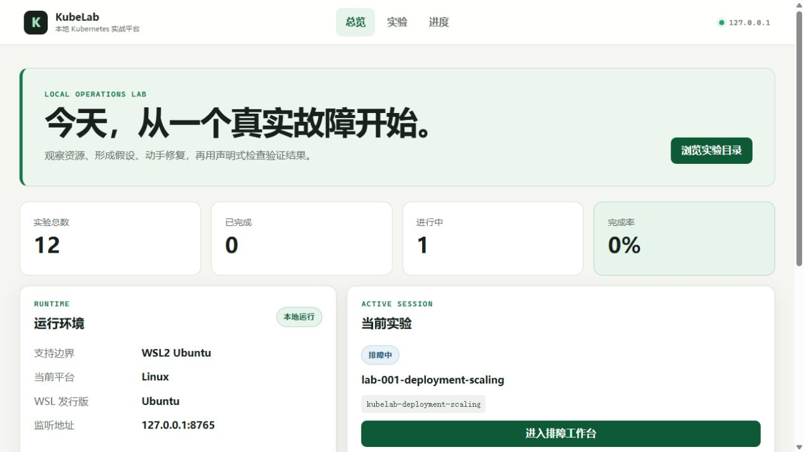
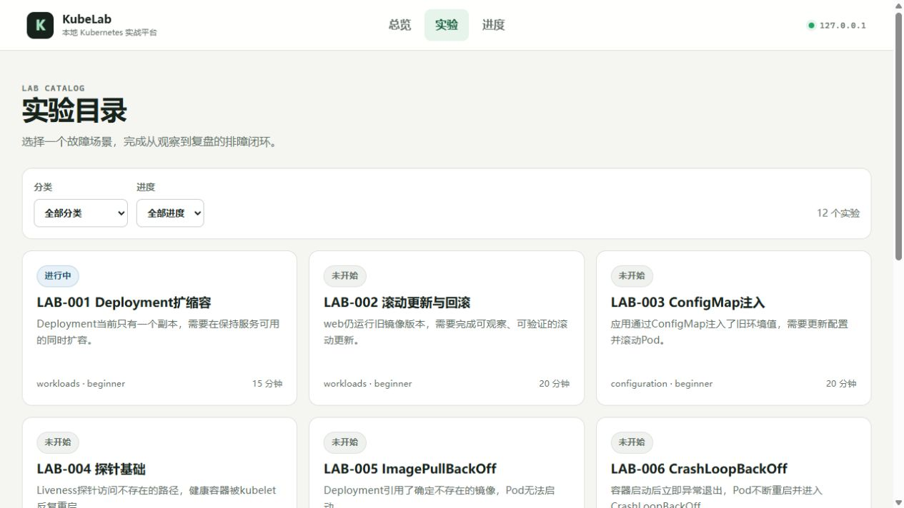
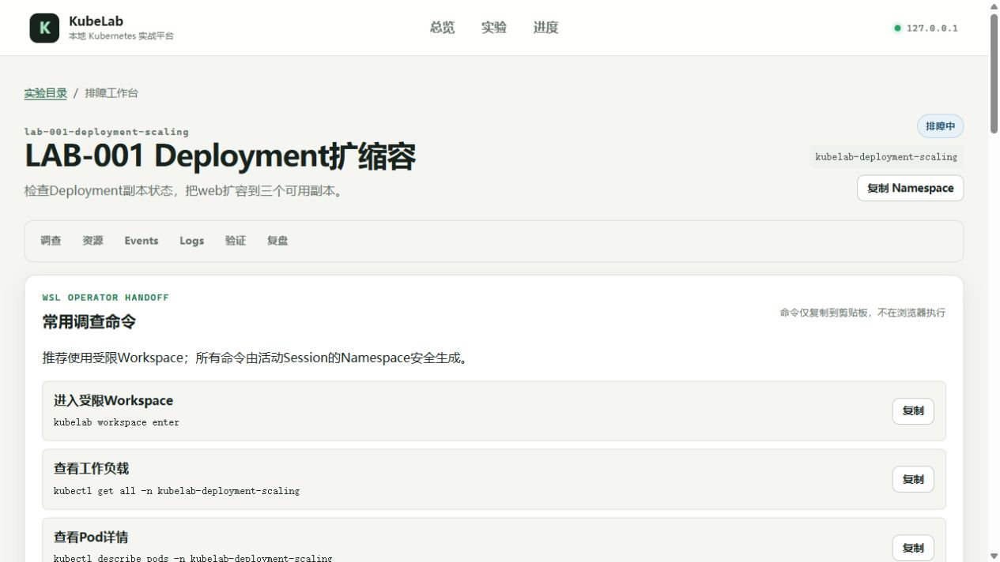

# KubeLab

KubeLab 是一个运行在 **Windows 11 + WSL2 Ubuntu** 中的本地 Kubernetes 运维练习平台。它以本机 Docker Engine 和 minikube 为实验环境，目标是把云原生运维面试知识转化为可以反复操作、验证和复盘的故障实验。

> 当前开发版本：`0.5.0a0`（M8实验作者工具链）。稳定发布版仍为`v0.1.0`；M6.1的`0.3.0rc1`本地发布候选验收及[Draft PR #5](https://github.com/CaoJun1015/Kubelab/pull/5)双平台CI均已通过。

## 界面预览



| 实验目录 | Session排障工作台 |
|---|---|
|  |  |

学习进度与390px移动端布局见[展示材料](docs/assets/README.md)。截图来自安装后的本地服务与安全实验数据，不含凭证、Token、用户路径或验证内部值。

## 当前可用功能

- `kubelab doctor`：检查 WSL2 Ubuntu、Python、Docker、kubectl、minikube、kubeconfig、节点、资源、StorageClass及可选组件；
- kubectl Client/API Server版本偏差检查，minor差值超过1时拒绝继续；
- `kubelab context inspect`：只读查看当前Context、minikube profile、脱敏API Server、CA指纹、`kube-system` UID和Server版本；
- `kubelab context trust`：仅信任经过验证的本地minikube身份；
- `kubelab context untrust`：只删除本地信任记录，不修改集群；
- `ContextTrustService.assert_trusted_context()`：为后续所有Kubernetes写操作提供统一安全守卫；
- `kubelab.io/v1alpha1`实验Schema：严格校验实验元数据、任务、检查、提示和声明式清理配置；
- `LabRegistry`：确定性扫描本地实验，隔离损坏实验并拒绝危险Manifest、路径逃逸和集群级资源；
- 二十一个声明式实验：18个单根因基线、12个固定复练变体和3个双根因高级场景，共33个可执行场景；
- 首次练习固定使用基线；基线首次成功后按确定性规则轮换两个固定变体，中断时继续原场景，不提供随机抽题、计时、评分或排名；
- M7四条专题学习路径：工作负载生命周期、配置与应用依赖、服务发现与流量链路、存储与调度；路径把基线、固定变体和综合实验组织为可解释的能力地图；
- Dashboard提供唯一且可解释的下一步建议，活动Session始终优先；综合实验按既有成功事实解锁，路径进度不建立第二套业务状态；
- 21张实验前/后知识卡和9类症状索引；通过前只展示概念、成功目标和证据清单，通过后展示根因、最小修复、误区和预防措施；
- M8本地实验作者工具链：`lab init/lint/test/inspect/package`复用运行时Schema、Registry、安全扫描和验证引擎，默认不访问数据库或Kubernetes；
- 33个场景均带严格`authoring.yaml`，声明故障、第一阶段修复（综合场景）、完整修复、reset观测以及修复允许的资源与JSON Pointer；
- 专题成果从Session、提示和验证记录派生，可导出有界、脱敏的Markdown，不提供隐藏评分或排名；
- wheel内置全部21个实验目录、12个变体、Jinja模板和静态资源，安装后不依赖源码仓库中的`labs/`；
- 可重复生成的实验与变体JSON Schema及错误脱敏；
- SQLAlchemy 2与Alembic持久化：保存Session、状态事件、验证记录、提示和复盘；
- M5首次引导：Web缓存展示WSL2、Docker、minikube、kubectl和Context信任结果，只有显式“重新检查”或启动实验才执行固定只读诊断；修复命令只允许复制；
- 实验级readiness门禁：`LabManager.start()`在创建Session和集群写入前检查Kubernetes版本、CPU、内存和Addon，未满足时返回`ENVIRONMENT_NOT_READY`；
- `SessionStateMachine`：拒绝非法生命周期转换，并由SQLite条件唯一索引保证最多一个活动实验；
- `SqlAlchemyUnitOfWork`和Repository：为后续CLI与Web提供统一事务边界；
- `OperationLock`：跨进程序列化未来的集群和数据库写操作；
- `KubernetesGateway`：只在Session作用域内创建受保护Namespace，执行server-side dry-run/apply，并提供脱敏资源、Pod、Events和受限Logs读取；
- Namespace删除前核对前缀、Session记录、管理标签、lab ID、Session ID和Context指纹；超时只报告finalizer和残留资源，不强制删除；
- `LabRegistry.materialize_for_gateway()`：Apply前重新读取、校验摘要并执行安全扫描，阻止扫描后替换文件；
- 9种声明式验证器：资源存在、Pod状态、Deployment可用副本、Service Endpoint、容器镜像、配置值、PVC状态、集群内HTTP响应和受限稳定DNS解析；
- `ValidationEngine`：顺序执行检查，使用500ms/1s/2s轮询、单项及全局deadline、Pod稳定窗口，并严格区分`passed/failed/error`；
- 初始故障契约：证明所有初始条件成立，同时证明至少一项成功条件尚未满足；每次运行和逐项结果在短事务中原子持久化；
- 受限curl探测Pod闭环：固定镜像、资源限额和安全上下文，只允许访问实验Service或内置minikube ingress-nginx目录，并在成功、失败或超时后清理；
- `LabManager`：通过短数据库事务协调`start/status/reset/cleanup`，在每次写操作前重新验证Context，并在部分Apply或初始契约失败时安全回滚；
- `LabManager.verify()`：READY首次验证转为IN_PROGRESS，仅在全部成功检查通过后转为PASSED；Context漂移或非法状态会被拒绝；
- LAB-005 ImagePullBackOff：精确验证镜像拉取waiting reason、正确镜像和Pod稳定Ready；
- LAB-006 CrashLoopBackOff：精确验证CrashLoopBackOff、重启次数及修复后的零重启稳定窗口；
- LAB-007 Service Selector错误：验证Deployment可用、Endpoint恢复和集群内HTTP 200；
- `kubelab list/show/start/status/resources/events/logs/verify/hint/reset/cleanup`：提供完整的M1命令行排障闭环；
- `kubelab retrospective edit`：在CLI中逐字段记录复盘，不启动外部编辑器；
- `kubelab workspace enter`：为唯一活动Session创建短期ServiceAccount令牌和Namespace限定RBAC，只启动固定的交互式bash；退出时撤销工作区RBAC并删除临时0600 kubeconfig；
- `kubelab serve`：在WSL2中仅监听`127.0.0.1:8765`，提供复用同一Application Service的FastAPI REST API；
- Web API使用Pydantic v2公开DTO、统一`code/message/context/retryable`错误、精确Origin与双提交CSRF校验；资源接口完全排除Secret和Kubernetes原始对象，不公开验证expected/actual、完整Manifest、凭证或异常堆栈；
- Jinja2与原生JavaScript本地界面：提供总览、实验目录、实验详情、排障工作台和学习进度；资源每2秒轮询，页面不可见时暂停，Events和Logs仅手动刷新；
- 排障工作台可安全复制活动Namespace和常用只读调查命令；页面不提供终端，实际调查和修复必须进入WSL受限工作区；
- 浏览器或服务重启后从SQLite恢复活动Session；集群协调必须由用户显式触发，GET不会推进Session状态。工作台展示派生阶段、学习时间线和best-effort脱敏资源快照；
- 三层提示固定为观察方向、建议命令和故障方向，验证公开为`passed/failed/unavailable`；学习成果、首次完成、重复练习和完成耗时均从既有记录派生；
- 复盘自动附加脱敏实验元数据和公开验证结果，并可下载有长度上限、已中和HTML的Markdown文件；
- Web页面使用严格CSP、安全响应头、Jinja自动转义和DOM文本渲染；reset与cleanup必须输入活动Namespace精确确认值；
- 状态协调：外部删除环境时受控完成Session，Namespace身份不匹配时转为`error`且拒绝删除，reset保留Session ID并支持中断重试；
- JSON输出、稳定退出码、凭证脱敏和原子配置写入。

## 支持环境

正式支持的MVP环境：

- Windows 11；
- WSL2 Ubuntu 22.04或24.04；
- WSL Ubuntu内部运行的Docker Engine；
- Docker驱动的minikube；
- Python 3.11（由uv管理）；
- kubectl与Kubernetes API Server相差不超过1个minor。

Windows只负责编辑代码和通过localhost访问本地Web API。`kubelab`、Docker、minikube、kubectl和kubeconfig必须位于同一个WSL Ubuntu环境中。

## 快速开始

如果WSL2、Docker、minikube和kubectl已经可用：

```bash
curl -LsSf https://astral.sh/uv/0.12.5/install.sh | sh
export PATH="$HOME/.local/bin:$PATH"

uv python install 3.11

curl -LO https://github.com/CaoJun1015/Kubelab/releases/download/v0.1.0/kubelab-0.1.0-py3-none-any.whl
curl -LO https://github.com/CaoJun1015/Kubelab/releases/download/v0.1.0/SHA256SUMS
sha256sum --check --ignore-missing SHA256SUMS
uv tool install --python 3.11 ./kubelab-0.1.0-py3-none-any.whl

minikube start \
  --driver=docker \
  --cpus=2 \
  --memory=4096 \
  --kubernetes-version=v1.35.1

kubelab doctor
kubelab context inspect
kubelab context trust
kubelab context inspect
```

最后一次检查应显示：

```text
Trusted: yes
Trust state: trusted
```

从一台全新Windows电脑开始安装，请阅读[完整部署手册](docs/DEPLOYMENT.md)。

## 21个实验操作教程

[《KubeLab 21个实验操作教程》](docs/TUTORIAL.md)按“是什么、为什么、怎么做”讲解全部基线场景，并为每个实验提供观察顺序、根因判断、最小修复和完成条件。

建议先独立练习，再把教程作为复盘材料。教程会公开21个基线场景的修复方法，但不会提前泄露LAB-013至018盲练变体的场景名和答案。

推荐顺序：

| 专题 | 建议实验 |
|---|---|
| 工作负载基础 | LAB-001、002、004、005、006、010 |
| 配置管理 | LAB-003、008、014、019 |
| 服务与流量 | LAB-007、009、011、013、016、021 |
| 存储与调度 | LAB-012、017、018、020 |

## 日常使用

打开Windows Terminal中的Ubuntu：

```bash
minikube status
kubelab doctor
kubelab context inspect
```

如果minikube没有运行：

```bash
minikube start
kubelab doctor
```

只有在确认自己主动重建了minikube，或者可信集群地址确实发生变化时，才重新执行：

```bash
kubelab context trust
```

不要对陌生、公司生产或远程Context执行信任命令。

### 开始第一个实验

```bash
# 浏览目录和任务说明
kubelab list
kubelab show lab-005-image-pull

# 一次只允许启动一个实验
kubelab start lab-005-image-pull

# 使用外部kubectl调查和修复
kubectl get pods -n kubelab-image-pull-backoff
kubelab resources
kubelab events
kubelab logs <pod-name> --container web

# 卡住时一次解锁一层提示；修复后验证
kubelab hint
kubelab verify

# 重建初始故障，或安全清理实验Namespace
kubelab reset
kubelab cleanup

# 清理后仍可编辑最近一次实验复盘
kubelab retrospective edit
```

`status`、`resources`、`events`、`logs`、`verify`、`hint`、`reset`和`cleanup`默认作用于唯一活动Session，因此日常使用不需要复制Session ID。`reset`和`cleanup`会显示目标Namespace并要求确认，不提供绕过所有权校验的`--force`。

推荐的Web与WSL协作流程：

```bash
# Web中选择并启动实验后，在WSL进入该Session的受限环境
kubelab workspace enter

# shell已经固定当前Namespace，可使用kubectl调查和修复
kubectl get all
kubectl get events --sort-by=.lastTimestamp

# 完成后退出，临时令牌、RBAC和kubeconfig会被撤销
exit
```

工作区只能访问活动实验Namespace中的非敏感资源，不能读取Secret、修改RBAC或访问集群级Namespace。不要在另一个普通管理员终端执行实验修复；回到Web点击“验证”，通过后保存复盘并清理。

## 实验作者工具

作者命令可在Windows或WSL运行，默认只读取本地文件，不创建学习Session，也不连接集群：

```bash
# 生成安全的实验骨架；先预览文件清单也不会写文件
kubelab lab init labs/lab-022-sample --type baseline \
  --id lab-022-sample --title "样例故障" --category workload \
  --difficulty intermediate --description "用于演示作者工作流" --dry-run

kubelab lab lint labs/lab-022-sample
kubelab lab test labs/lab-022-sample
kubelab lab inspect labs/lab-022-sample
kubelab lab package labs/lab-022-sample
```

五个命令都支持`--json`。`inspect`分别展示通过前和通过后的公开投影，只输出摘要、差异路径和相对路径；`package`在lint、Fake生命周期和泄漏检查通过后生成确定性的`.kubelab-lab.tar.gz`，不会安装产物。完整契约、退出码和综合实验写法见[实验开发指南](docs/LAB_DEVELOPMENT.md)。

真实测试入口默认关闭，只有维护者在明确授权的本机WSL2 Ubuntu环境中才可设置`KUBELAB_RUN_LAB_INTEGRATION=1`。它不接受远程Context，不执行Shell修复；日常开发和CI不得设置该变量。

所有目录、状态和验证命令均支持稳定的`--json`输出。`verify`未通过时退出码为1；参数或实验定义错误为2；环境或Context问题为3；活动Session冲突或非法状态为4；Kubernetes、数据库或内部故障为5。

### 启动本地Web界面与REST API

在WSL2 Ubuntu中运行：

```bash
kubelab serve
```

也可以使用仓库提供的一键脚本。它会在WSL中检查Docker驱动的本机`minikube` profile、按需启动集群、运行Doctor并把Web服务放到后台；它不会自动信任Context：

```bash
bash scripts/start_kubelab.sh
```

从Windows PowerShell一键启动并打开浏览器：

```powershell
.\scripts\start-kubelab.ps1
```

仅启动Web、查看状态或停止脚本管理的Web进程：

```powershell
.\scripts\start-kubelab.ps1 -WebOnly
.\scripts\start-kubelab.ps1 -Action Status -NoBrowser
.\scripts\start-kubelab.ps1 -Action Stop -NoBrowser
```

停止操作不会停止minikube。Docker daemon不可用、现有`minikube` profile不是Docker驱动或环境身份漂移时，脚本会失败关闭或让Web显示明确引导，不会调用`sudo`、自动修改Context信任或连接远程集群。

在Windows浏览器打开`http://127.0.0.1:8765/`即可使用本地控制台。首次使用先打开“环境”页面并点击“重新检查”；环境就绪后从“路径”进入推荐专题，也可以从“症状索引”反查相关实验。页面只展示固定建议，不会执行修复命令。健康检查为`GET /health`，REST API位于`/api/v1/`。Session工作台提供“复制Namespace”和常用调查命令，但不提供浏览器终端。服务不启用CORS，并拒绝跨站Origin。所有写请求（包括环境重新检查和显式Session协调）使用HttpOnly、SameSite=Strict Cookie与同值`X-CSRF-Token`双提交校验；reset与cleanup还必须提交当前活动Session的精确Namespace确认值。

### Doctor状态和退出码

| 状态 | 含义 | 退出码 |
|---|---|---:|
| `healthy` | 必需项和可选项全部正常 | 0 |
| `degraded` | 必需项正常，但Helm、Ingress或metrics-server等可选项缺失 | 0 |
| `unhealthy` | 必需环境不满足 | 3 |

查看适合脚本处理的结果：

```bash
kubelab doctor --json
kubelab context inspect --json
```

### Context命令

```bash
# 只读，不修改本地配置或集群
kubelab context inspect

# 验证当前环境是本地minikube后，保存无凭证身份指纹
kubelab context trust

# 仅删除当前Context的本地信任记录
kubelab context untrust
```

信任记录默认位于：

```text
~/.config/kubelab/config.toml
```

其中只保存Context名称、规范化API Server、CA SHA256、`kube-system` UID、minikube profile和信任时间，不保存Token、私钥、证书原文或Secret。

## 从源码开发

```bash
git clone https://github.com/CaoJun1015/Kubelab.git
cd Kubelab

uv python install 3.11
uv sync --frozen

uv run pytest
uv run ruff check .
uv run ruff format --check .
uv run mypy src
```

如果Windows与WSL对同一工作目录执行检查，必须为两端配置不同的uv虚拟环境路径，不能共享`.venv`；更推荐把正式WSL开发副本放在Linux文件系统中。

当前质量基线：Windows和WSL的最终数据见TDD“当前环境说明”。两端均要求pytest覆盖率不低于90%，并通过Ruff、格式检查、strict mypy、JavaScript语法、构建、统一产物检查和`git diff --check`。真实集成测试默认关闭，只能在已信任的本地minikube中显式运行。

只有在WSL中确认`kubelab context inspect`显示`trusted`后，才可显式运行真实网关测试：

```bash
KUBELAB_RUN_INTEGRATION=1 uv run pytest --no-cov -q tests/test_kubernetes_gateway_integration.py

# 全部33个场景的真实start → 受限workspace修复 → verify → reset → cleanup契约
KUBELAB_RUN_LAB_INTEGRATION=1 uv run pytest --no-cov -q tests/test_first_labs_integration.py
```

全部21个基线和12个变体默认使用Fake Gateway证明`initial → success预检失败 → fix → reset`契约，不接触集群。M6.1已在受信任的本机Docker驱动minikube中把33个场景分为四批连续验收通过；入口仍默认关闭。测试只允许创建随机`kubelab-test-*` Namespace，并验证Secret、集群级Namespace和残留资源安全边界。执行前要求固定版本镜像已进入minikube缓存，LAB-011要求Ingress Controller可用，LAB-012、LAB-018和LAB-020要求默认`standard` StorageClass及storage-provisioner可用。不要在远程或生产Context运行。脱敏结果见[M6.1验收记录](docs/environment-snapshots/2026-08-31-m6-1-acceptance.md)。

## 安全边界

- Schema和Registry扫描仍完全不访问集群；CLI和Web通过Application Service调用`KubernetesGateway`，不直接使用Kubernetes Client或ORM；Web也不会启动CLI子进程；
- 数据库、备份和操作锁默认位于`${XDG_STATE_HOME:-~/.local/state}/kubelab/`，拒绝使用`/mnt/c`或`/mnt/d`作为正式状态目录；
- SQLite启用WAL、外键和5000ms busy timeout，迁移前在独占锁内创建安全备份；
- 仅允许显式信任可证明属于本机的minikube；
- API Server必须使用HTTPS，并且是回环地址或与`minikube ip`完全一致；
- Context、Server、CA、`kube-system` UID或profile漂移时，未来写操作会被拒绝；
- 不执行实验提供的任意宿主机命令；
- 只删除数据库Session作用域和全部所有权元数据完全匹配的`kubelab-*` Namespace；绝不移除finalizer或修改`kube-system`；
- 日志、JSON和配置不得保存Kubernetes凭证。
- workspace临时kubeconfig只包含当前集群CA、短期ServiceAccount令牌和活动Namespace；文件权限为0600，shell退出后先撤销固定RBAC再删除临时目录；

## 项目结构

```text
src/kubelab/              Python包、CLI、本地REST API和Web界面
tests/                    单元测试
labs/                     二十一个实验族与十二个固定变体
docs/                     部署与环境文档
scripts/                  发布产物与WSL隔离验收脚本
.github/                  双平台CI、Issue表单和PR模板
PRD-KubeLab.md            产品需求基线
TDD-KubeLab.md            技术设计基线
cloud-native-ops-roadmap.html  云原生运维学习路线
```

## 开发路线

- [x] M1-01 Python工程基线和CLI；
- [x] M1-02 Environment Doctor；
- [x] M1-03 minikube Context信任；
- [x] M1-04 实验Schema和LabRegistry；
- [x] M1-05 SQLite、状态机和操作锁；
- [x] M1-06 KubernetesGateway；
- [x] M1-07 LabManager；
- [x] M1-08 ValidationEngine；
- [x] M1-09 首批三个故障实验；
- [x] M1-10 CLI垂直切片验收；
- [x] M2-01 FastAPI应用基线与REST API；
- [x] M2-02 本地HTML页面；
- [x] M3 十二个声明式实验。
- [x] M3-01 受限WSL工作区、wheel实验打包与12实验真实验收。
- [x] M4 首个GitHub-only稳定版发布就绪。
- [x] M5 引导式排障学习闭环。
- [x] LAB-013至018 六个中级排障实验与18实验真实验收。
- [x] M6 可复现故障变体、盲练揭示和三个双根因高级场景。
- [x] M6.1 `0.3.0rc1`双平台质量门、停止态wheel烟测与33场景真实验收。
- [x] M7 `0.4.0a0`专题学习路径、确定性推荐、症状索引和专题成果。
- [x] M8 `0.5.0a0`声明式作者契约、安全脚手架、统一lint/Fake测试、公开边界检查和确定性实验包。

详细资料见[21个实验操作教程](docs/TUTORIAL.md)、[M7专题学习路径PRD](docs/PRD-M7-LEARNING-PATHS.md)、[M8作者工具PRD](docs/PRD-M8-AUTHOR-TOOLCHAIN.md)、[PRD](PRD-KubeLab.md)、[TDD](TDD-KubeLab.md)、[架构说明](docs/ARCHITECTURE.md)、[实验开发指南](docs/LAB_DEVELOPMENT.md)、[贡献指南](CONTRIBUTING.md)和[安全策略](SECURITY.md)。

## 常见问题

### 每次打开Ubuntu都要重新安装或信任吗？

不需要。uv工具环境、`kubelab`命令和Context信任都保存在WSL用户目录中。重启后通常只需要确认Docker和minikube是否运行。

### Doctor显示`degraded`能否继续？

可以，只要失败项中没有必需组件。Helm、Ingress和metrics-server当前是可选项。

### 为什么不支持PowerShell直接运行KubeLab？

因为KubeLab必须与Docker、minikube、kubectl和kubeconfig处于同一个Linux系统边界。PowerShell只适合进入WSL或管理Windows侧文件。

### 现在能开始故障实验吗？

可以。在WSL Ubuntu中先确认`kubelab doctor`没有必需项失败、`kubelab context inspect`显示`trusted`，然后运行`kubelab list`并选择一个实验执行`kubelab start <lab-id>`。
