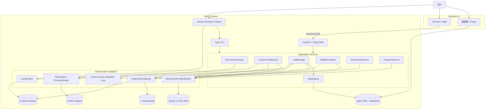
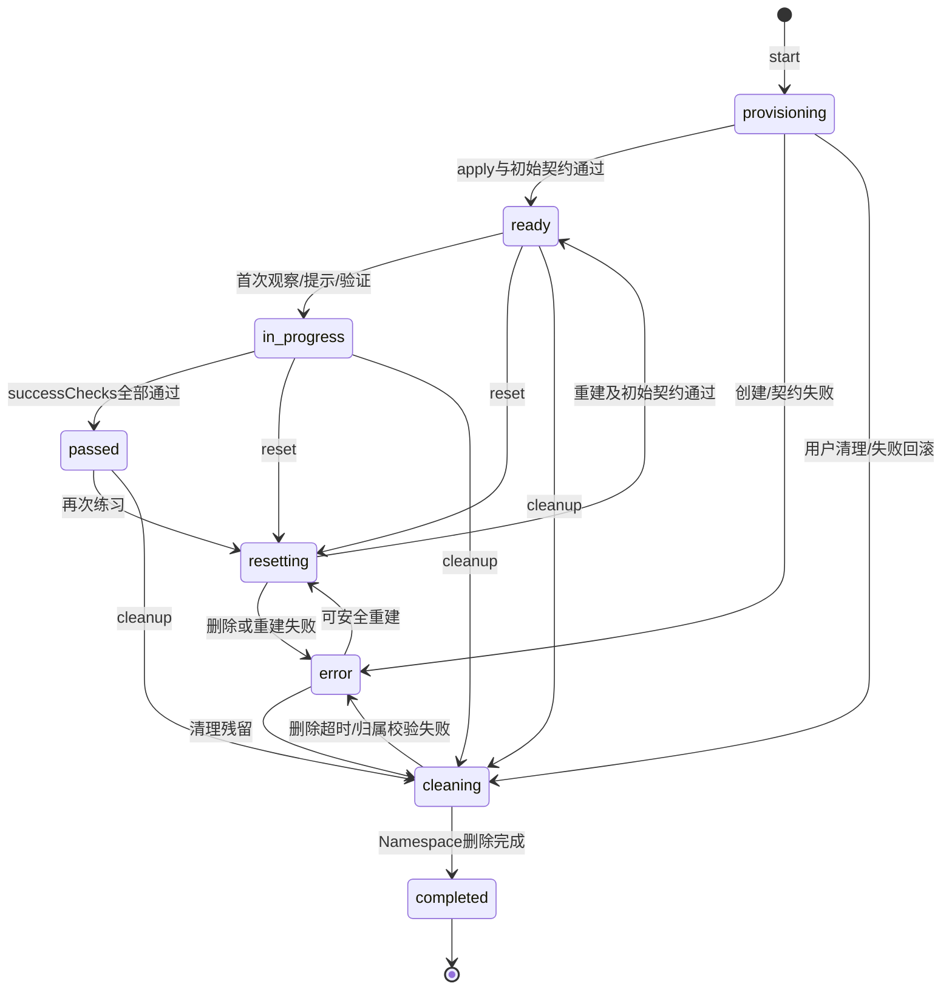
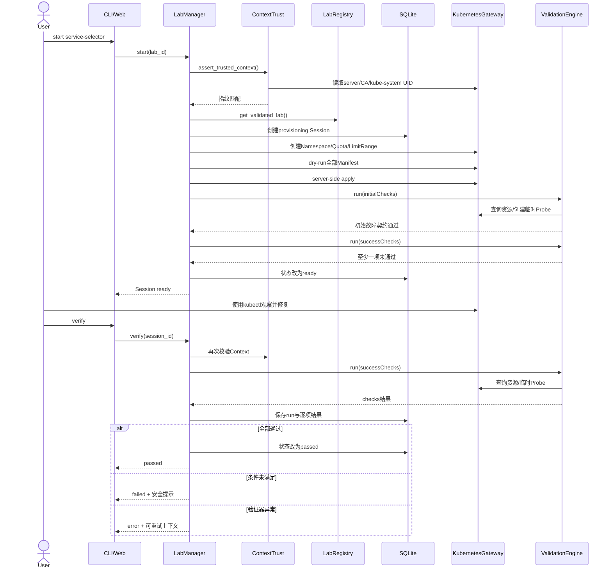

# KubeLab 技术设计文档（TDD）

> 文档版本：v0.2
> 对应PRD：[PRD-KubeLab.md](./PRD-KubeLab.md) v0.2
> 设计范围：完整MVP架构，M1 CLI垂直切片详细设计
> 目标环境：Windows 11 + WSL2 Ubuntu、Python 3.11、Docker Engine、minikube
> Schema版本：`kubelab.io/v1alpha1`
> 状态：实现基线

---

## 1. 设计目标

本文档把KubeLab PRD转化为可直接实现的技术方案，重点解决：

1. 如何安全连接并识别本地minikube，而不误操作其他集群；
2. 如何用YAML描述可重复的故障实验；
3. 如何安全创建、验证、重置和清理实验；
4. 如何让CLI和Web复用同一套业务逻辑；
5. 如何保存学习记录并在进程异常后恢复状态；
6. 如何以自动化测试证明实验初始状态错误、修复后正确；
7. 如何把M1控制在三个实验的可交付垂直切片内；
8. 如何避免Windows与WSL的工具、路径、虚拟环境和SQLite状态互相污染。

### 1.1 设计原则

- **WSL本地优先**：应用进程、配置、数据库、日志和集群状态默认只存在WSL2 Ubuntu；
- **安全优先**：未经信任的Context不执行任何写操作；
- **实验即数据**：新增普通实验不修改核心代码；
- **测试先行**：每个功能先定义正常、异常和边界测试；
- **失败可恢复**：所有写操作有超时、清理路径和明确残留报告；
- **单一业务核心**：CLI和Web只做适配，不复制业务规则；
- **不泄露答案**：验证结果告诉用户目标未满足，不直接暴露根因；
- **不过度设计**：MVP不引入消息队列、前端构建链、多用户和Operator。

### 1.2 MVP边界

MVP只正式支持Windows 11上的WSL2 Ubuntu进程和显式信任的minikube Context。Windows原生Python进程、非Ubuntu WSL发行版、独立Linux主机、kind、Helm实验、面试模式、浏览器终端和AI排障不进入MVP实现，但本文档为M2 Web和M3实验扩展保留稳定接口。Windows只承担代码编辑和通过localhost访问Web页面。

---

## 2. 已确定的技术决策

| 决策项 | 结论 | 原因 |
|---|---|---|
| Python版本 | WSL2 Ubuntu中的Python 3.11 | 与目标Linux运维环境一致，并保持当前工程锁定范围 |
| 依赖管理 | `uv` + `pyproject.toml` + lockfile | 安装和复现成本低；Windows与WSL使用独立虚拟环境 |
| 运行方式 | WSL2 Ubuntu进程 | 与Docker、minikube、kubectl和kubeconfig处于同一系统边界 |
| Schema真源 | Pydantic v2模型 | 同时提供运行时校验、类型和JSON Schema导出 |
| Schema版本 | `kubelab.io/v1alpha1` | MVP允许字段调整，不承诺v1稳定性 |
| Kubernetes操作 | 官方Python Client + Dynamic Client | 不依赖拼接kubectl命令，便于安全检查和测试 |
| HTTP验证 | 临时curl探测Pod | 从集群内部验证Service/Ingress，行为更接近真实流量 |
| 数据库 | SQLite + SQLAlchemy 2 + Alembic | 适合单用户本地应用，同时保留迁移能力 |
| Web | FastAPI + Jinja2 + 原生JavaScript | 无Node构建链，减少非核心开发量 |
| Context策略 | 显式信任minikube Context | 兼容自定义profile，同时拒绝任意Context |
| 并发策略 | 只允许一个活动实验 | 降低资源占用、状态冲突和误删除风险 |
| Namespace卡死 | 超时并报告，不移除finalizer | 防止为追求自动化而扩大破坏范围 |
| Helm调用 | P1使用Helm CLI子进程 | Python无官方Helm SDK；MVP不实现Helm实验 |
| WSL2 Ubuntu安装 | 开发期使用uv；开源期提供`uv tool install` | 避免MVP提前维护跨平台独立可执行文件 |

---

## 3. 系统架构



### 3.1 分层规则

```text
Presentation（CLI / Web）
    ↓ 只调用
Application Services
    ↓ 依赖接口
Domain（Schema、状态机、验证结果、安全策略）
    ↓ 由适配器实现
Infrastructure（Kubernetes、SQLite、文件、子进程）
```

- CLI和Web不得直接调用Kubernetes Client或SQLAlchemy Session；
- Application Service不得依赖Typer、FastAPI Request或HTML类型；
- Kubernetes对象在Gateway内转换为项目自己的DTO；
- 数据库ORM对象不得直接作为REST响应；
- 所有时间以UTC保存，展示层再转换为本地时间；
- 所有写操作必须先经过Context校验和跨进程锁。

---

## 4. 运行时与本地目录

### 4.1 进程模型

- CLI命令为短生命周期进程；
- Web由`kubelab serve`启动单个Uvicorn进程；
- Web在WSL2中绑定`127.0.0.1:8765`，通过WSL localhost转发供Windows浏览器访问；MVP禁止绑定`0.0.0.0`；
- CLI和Web可能同时启动，因此写操作必须使用跨进程文件锁；
- Web的start/reset/cleanup使用同步、有界操作，页面显示等待状态；MVP不引入后台队列；
- Kubernetes用户操作继续在外部WSL2 Ubuntu终端完成，Web不提供Shell。

### 4.2 目录约定

```text
${XDG_CONFIG_HOME:-~/.config}/kubelab/
└── config.toml

${XDG_STATE_HOME:-~/.local/state}/kubelab/
├── kubelab.db
├── kubelab.db.bak
├── operations.lock
└── logs/
    └── kubelab.log

~/.local/share/kubelab/
└── venv/                    # 推荐的WSL专用uv环境
```

配置、数据库、锁、日志和虚拟环境必须位于WSL Linux文件系统，不得位于`/mnt/c`、`/mnt/d`等DrvFs挂载目录。源码可以从`/mnt/d`运行，但推荐迁移到WSL Home以改善文件监控和测试性能。Windows创建的`.venv`不得在WSL复用；开发时设置`UV_PROJECT_ENVIRONMENT=$HOME/.local/share/kubelab/venv`。

开发和测试允许通过环境变量覆盖：

```text
KUBELAB_CONFIG_FILE
KUBELAB_DATA_DIR
KUBELAB_LABS_DIR
KUBELAB_LOG_LEVEL
KUBELAB_KUBECONFIG
XDG_CONFIG_HOME
XDG_STATE_HOME
UV_PROJECT_ENVIRONMENT
```

### 4.3 配置格式

```toml
[tools]
docker = "/usr/bin/docker"
kubectl = "/usr/bin/kubectl"
minikube = "/usr/local/bin/minikube"
helm = "/usr/local/bin/helm"

[kubernetes]
kubeconfig = ""
current_context = ""

[validation]
probe_image = "curlimages/curl:8.12.1"
probe_timeout_seconds = 30

[web]
host = "127.0.0.1"
port = 8765

[[trusted_contexts]]
name = "minikube"
server = "https://127.0.0.1:54321"
ca_sha256 = "..."
kube_system_uid = "..."
minikube_profile = "minikube"
trusted_at = "2026-08-25T12:00:00Z"
```

规则：

- 空工具路径表示自动发现；
- 显式工具路径必须为存在的绝对文件路径；
- 配置写入采用临时文件加原子替换，避免部分写入；
- `trusted_contexts`不得由实验内容修改；
- 配置中不保存kubeconfig token、客户端证书私钥或Secret。

### 4.4 工具发现顺序

`ToolLocator`对Docker、kubectl、minikube和Helm按照以下顺序查找：

1. `config.toml`中的显式绝对路径；
2. `shutil.which()`搜索当前PATH；
3. WSL2 Ubuntu常见位置：`/usr/local/bin`、`/usr/bin`、`/snap/bin`、`~/.local/bin`和Linuxbrew；
4. 未找到时返回`TOOL_NOT_FOUND`，并显示配置示例。

子进程调用必须使用参数数组和`shell=False`，不得拼接用户输入形成命令字符串。KubeLab核心资源操作不依赖kubectl；kubectl仍作为用户练习和环境检查的必要工具。

---

## 5. 核心模块职责

### 5.1 EnvironmentDoctor

负责只读检查：

- 当前进程是否运行在WSL2；
- WSL发行版是否为Ubuntu；
- 工具是否存在及版本能否读取；
- Docker是否可访问；
- minikube profile和状态；
- kubeconfig是否可读；
- 当前Context及API Server；
- Kubernetes API是否可访问；
- kubectl Client与API Server版本偏差是否在正负1个minor以内；
- 节点是否Ready；
- CPU、内存和StorageClass是否满足实验要求；
- ingress、metrics-server等可选组件是否存在。

Doctor永不创建、修改或删除集群资源；Context未信任时仍允许执行Doctor。

### 5.2 ContextTrustService

负责查看、信任、撤销信任及每次写操作前的指纹校验。详细安全规则见第10节。

### 5.3 LabRegistry

负责：

- 扫描实验目录；
- 加载`lab.yaml`；
- Pydantic校验；
- 检查ID唯一性；
- 安全解析Manifest相对路径；
- 扫描Manifest安全策略；
- 返回合法实验和带上下文的加载错误。

单个实验无效不会阻止其他实验加载，但`kubelab list`必须显示被拒绝实验的文件和原因。

### 5.4 LabManager

负责实验生命周期：

- 创建Session；
- 检查唯一活动Session；
- 创建Namespace和保护资源；
- Dry-run并Apply Manifest；
- 执行初始故障契约；
- 状态协调；
- 重置、清理和失败回滚；
- 记录状态事件。

### 5.5 ValidationEngine

负责加载验证器、执行`initialChecks`或`successChecks`、聚合结果并持久化验证记录。验证器只观察或创建平台自有探测Pod，不直接修复用户资源。

### 5.6 KubernetesGateway

封装官方Kubernetes Client，提供Namespace、Manifest、资源DTO、Events、Logs、探测Pod和安全删除操作。所有API调用必须设置超时并转换为项目错误类型。

### 5.7 Repositories

封装SQLite访问。Application Service通过Repository接口工作，不直接编写SQL。事务边界由Application Service控制。

---

## 6. 实验Schema

### 6.1 真源和兼容策略

- Pydantic v2模型是Schema唯一真源；
- 构建时从模型生成`lab.schema.json`；
- CI验证已提交JSON Schema与模型生成结果一致；
- `apiVersion`必须等于`kubelab.io/v1alpha1`；
- `kind`必须等于`Lab`；
- v1alpha1期间允许破坏性调整，但每次调整必须同步实验Fixture和文档；
- 未知字段默认拒绝，避免拼写错误被静默忽略。

### 6.2 顶层结构

```yaml
apiVersion: kubelab.io/v1alpha1
kind: Lab

metadata:
  id: service-selector
  name: Service无法访问Pod
  description: Pod正常运行，但Service没有可用后端。
  difficulty: beginner
  durationMinutes: 20
  category: networking
  tags: [service, endpoint, label]

requirements:
  kubernetes: ">=1.28"
  minimumCpu: 2
  minimumMemoryMiB: 2048
  addons: []

environment:
  namespace: kubelab-service-selector
  manifests:
    - manifests/deployment.yaml
    - manifests/service.yaml
  provisionTimeoutSeconds: 120

task:
  description: |
    Web Pod正在运行，但通过Service无法访问。
    请定位故障并恢复服务。
  completionDescription: Service恢复后端并返回HTTP 200。
  successMessage: Service已经正确匹配Pod，应用访问恢复。

initialChecks:
  - id: deployment-running
    type: deployment_available
    name: web
    minimumReplicas: 2
    timeoutSeconds: 60
    unmetMessage: 实验工作负载未达到预期初始状态。

  - id: service-empty
    type: service_endpoint_count
    name: web-service
    exactly: 0
    timeoutSeconds: 30
    unmetMessage: 故障场景未正确建立。

successChecks:
  - id: service-restored
    type: service_endpoint_count
    name: web-service
    minimum: 2
    timeoutSeconds: 30
    unmetMessage: Service仍未获得足够的可用后端。

  - id: http-restored
    type: http_response
    target:
      mode: service
      name: web-service
      port: 80
      path: /
    expectedStatus: 200
    timeoutSeconds: 30
    unmetMessage: 应用入口尚未返回预期状态。

hints:
  - level: 1
    content: 检查流量是否找到后端实例。
  - level: 2
    content: 比较Service Selector与Pod Label。
  - level: 3
    content: 使用kubectl get endpoints和kubectl get pods --show-labels。

cleanup:
  deleteNamespace: true

interview:
  questions:
    - Service如何发现后端Pod？
    - Service存在但Endpoint为空可能有哪些原因？
```

### 6.3 字段约束

- `metadata.id`匹配`^[a-z][a-z0-9-]{2,39}$`；
- `metadata.name`长度1至80；
- `difficulty`为`beginner | intermediate | advanced`；
- `durationMinutes`为5至180；
- `environment.namespace`必须以`kubelab-`开头并满足DNS Label规则；
- Manifest路径必须是实验目录内的相对路径；
- 初始化超时范围10至300秒；
- `initialChecks`和`successChecks`均至少一个；
- Check ID在各自列表中唯一；
- 提示level必须从1开始连续递增，最多3级；
- `cleanup.deleteNamespace`在v1alpha1中必须为`true`；
- Schema不支持setup、cleanup或verify任意命令字段。

### 6.4 验证器判别联合

所有Check共有字段：

```text
id: string
type: discriminator
timeoutSeconds: 1..120
unmetMessage: 面向用户且不泄露根因的文本
```

P0验证类型：

| type | 关键字段 | 判定 |
|---|---|---|
| `resource_exists` | apiVersion/kind/name | 资源存在 |
| `pod_status` | selector/expectedPhase/minimumCount/minimumReady/stableSeconds/ready/containerName/expectedWaitingReasons/minimumRestartCount/maximumRestartCount | 匹配Pod达到目标Phase，并可精确约束Pod或容器Ready、waiting reason和重启次数 |
| `deployment_available` | name/minimumReplicas | availableReplicas达到下限 |
| `service_endpoint_count` | name/minimum/maximum/exactly | EndpointSlice可用地址数量满足约束 |
| `container_image` | workloadKind/workloadName/container/expectedImage | 容器镜像完全匹配 |
| `config_value` | sourceKind/sourceName/key/expectedValue | ConfigMap或Secret中值匹配 |
| `pvc_status` | name/expectedPhase | PVC达到目标Phase |
| `http_response` | target/expectedStatus | 集群内HTTP返回预期状态 |

`minimum`、`maximum`和`exactly`至少出现一个；使用`exactly`时不得同时设置其他数量字段。

`pod_status`中的waiting reason和restart约束必须同时指定`containerName`；`minimumRestartCount`不得大于`maximumRestartCount`。`minimumReady`始终统计Pod Ready数量，`ready`在指定`containerName`时检查该容器，否则检查整个Pod。

M1-04确认上述8种类型为`kubelab.io/v1alpha1`唯一正式协议，不兼容早期草案中的`resource_not_exists`、`pod_phase`、`pod_ready`、`pvc_phase`和`http_status`。`http_response.target`只接受结构化Service或Ingress引用，不接受任意URL。

### 6.5 初始故障契约

实验创建完成必须满足：

1. 所有`initialChecks`通过，证明故障环境已正确建立；
2. 至少一个`successChecks`不通过，证明实验不是一开始就已完成；
3. 检查执行错误与预期不满足分开处理；
4. 初始契约失败时Session进入`error`并执行安全清理；
5. 用户界面只显示“实验初始化失败”，详细检查结果写入本地日志和状态事件。

---

## 7. Manifest加载与安全策略

### 7.1 加载流程

```text
解析相对路径
→ 确认规范化路径仍在实验目录内
→ 拒绝指向目录外的符号链接
→ yaml.safe_load_all
→ 拒绝空文档和未知顶层结构
→ Kind白名单
→ Namespace注入/校验
→ PodSpec安全扫描
→ Server-side dry-run
→ 按依赖顺序Server-side apply
```

### 7.2 P0允许的资源

```text
v1/Pod
v1/Service
v1/ConfigMap
v1/Secret
v1/PersistentVolumeClaim
apps/v1/Deployment
apps/v1/StatefulSet
apps/v1/DaemonSet
batch/v1/Job
batch/v1/CronJob
networking.k8s.io/v1/Ingress
```

Namespace、ResourceQuota和LimitRange只允许由平台创建。所有Cluster-scoped资源、CRD及未知Kind均拒绝。

### 7.3 禁止项

递归扫描Pod、Deployment、StatefulSet、DaemonSet、Job和CronJob中的PodSpec，拒绝：

- `privileged: true`；
- `hostNetwork: true`、`hostPID: true`、`hostIPC: true`；
- HostPath Volume；
- hostPort；
- capabilities增加危险能力；
- procMount为Unmasked；
- Windows HostProcess；
- Service类型NodePort或LoadBalancer；
- metadata.namespace指向实验Namespace之外；
- ownerReference指向实验外资源；
-超过平台上限的CPU、内存或存储申请。

### 7.4 平台保护资源

每个实验Namespace创建：

- Namespace管理标签和Session注解；
- ResourceQuota：Pods 20、Services 10、PVC 5、请求存储2Gi；
- LimitRange：默认request为100m/128Mi，默认limit为500m/512Mi，单容器最大2CPU/2Gi；
- 所有平台自有资源带`kubelab.io/managed-by=kubelab`标签。

### 7.5 Apply策略

- 使用Dynamic Client执行Server-side Apply；
- field manager固定为`kubelab`；
- `force=false`，不抢占用户已拥有字段；
- Apply前对全部Manifest执行server-side dry-run；
- Apply顺序为配置/存储、Service、工作负载、Ingress；
- 任意资源Apply失败时停止后续Apply并删除整个实验Namespace；
- 不逐个回滚资源，Namespace是唯一回滚边界。

---

## 8. 生命周期状态机



### 8.1 状态语义

| 状态 | 含义 | 是否占用活动实验名额 |
|---|---|---:|
| `provisioning` | 正在创建环境 | 是 |
| `ready` | 故障环境已建立，尚未通过平台开始观察 | 是 |
| `in_progress` | 用户已查看资源、使用提示或执行验证 | 是 |
| `passed` | 成功条件已满足，环境仍保留 | 是 |
| `resetting` | 正在删除并重建同一实验 | 是 |
| `cleaning` | 正在删除实验环境 | 是 |
| `completed` | 环境已安全清理，Session结束 | 否 |
| `error` | 操作失败，可能仍有残留环境 | 是，直到清理完成 |

`not_started`不是数据库Session状态，而是实验目录根据历史记录计算出的展示状态。

### 8.2 状态转换规则

- `start`只允许在不存在活动Session时执行；
- `status/resources/events/logs/hint/verify`首次调用会将`ready`变为`in_progress`；
- `verify`只有在`ready`或`in_progress`执行；全部成功后变为`passed`；
- `reset`允许在`ready/in_progress/passed/error`执行；
- `cleanup`允许在任意非`completed`状态执行，但必须重新校验Context和Namespace归属；
- 非法转换返回`INVALID_SESSION_STATE`，不修改数据库和集群；
- `error`保存错误码、上下文及是否检测到残留Namespace。

### 8.3 单活动Session约束

- Application Service在创建前查询活动Session；
- SQLite建立条件唯一索引，活动状态集合中最多一行；
- 所有写操作再由`operations.lock`串行化；
- 冲突返回现有Session ID和状态，不自动清理或替换。

---

## 9. 启动、验证与重置时序



### 9.1 Start失败处理

- 创建Session前失败：不写Session；
- Session已创建但Namespace未创建：Session转`error`，cleanup可直接转`completed`；
- Namespace创建后失败：执行安全删除；删除成功后保留`error`事件并将Session转`completed`；
- 删除失败：Session保持`error`并记录残留资源，阻止启动其他实验；
- 不允许忽略错误继续Apply剩余资源。

### 9.2 Reset流程

```text
校验活动Session
→ 校验Context指纹
→ 校验Namespace归属
→ 状态改为resetting
→ 删除Namespace并等待完成
→ 重新创建保护资源
→ Dry-run与Apply实验资源
→ 验证初始故障契约
→ reset_count + 1
→ 状态改为ready
```

Session ID保持不变，验证记录通过时间和reset序号区分。Reset任何阶段失败均进入`error`。

---

## 10. Context信任与Namespace安全边界

### 10.1 信任流程

`kubelab context trust`执行：

1. 只读取kubeconfig的当前Context和对应Cluster，不接受命令行传入其他Context；
2. 通过`minikube status --profile <当前Context>`确认同名profile存在且Host、Kubelet和API Server均为Running；
3. API Server必须是回环地址，或主机地址与`minikube ip --profile <当前Context>`完全一致；仅为私有网段不能证明是本地集群；
4. API Server必须使用HTTPS，并规范化为scheme、host和port；拒绝用户信息、路径、query及fragment；
5. 对kubeconfig内嵌或文件引用的CA证书内容计算SHA-256，不保存证书内容；
6. 只读访问`kube-system`获取Namespace UID，并读取Kubernetes Server版本；
7. 显示不含凭证的Context、profile、Server和指纹摘要，原子写入`config.toml`；同名记录采用安全覆盖，不产生重复项。

`context inspect`遵循同一身份采集流程但不写本地配置或集群；`context untrust`只根据kubeconfig当前Context删除本地记录，不连接或修改集群。三条命令均不接收Context名称参数，以保持日常操作简短并防止误选目标。

### 10.2 每次写操作的校验

以下值必须全部与信任记录一致：

- 当前Context名称；
- API Server规范化URL；
- CA证书SHA-256；
- `kube-system` UID；
- minikube profile仍存在且处于可访问状态。

任一项变化返回`CONTEXT_FINGERPRINT_MISMATCH`，禁止写操作。只读Doctor仍可运行。

### 10.3 撤销信任

- `context untrust`在存在活动Session时拒绝执行；
- 撤销信任只修改本地配置，不删除集群资源；
- 如果用户需要先清理活动实验，必须在原Context指纹仍匹配时执行cleanup；
- Context已经漂移时，平台只报告残留，不绕过安全校验删除。

### 10.4 Namespace归属

平台创建Namespace时写入：

```yaml
metadata:
  labels:
    kubelab.io/managed-by: kubelab
    kubelab.io/lab-id: service-selector
  annotations:
    kubelab.io/session-id: "<uuid>"
    kubelab.io/context-fingerprint: "<sha256>"
```

删除前必须同时满足：

1. 名称以`kubelab-`开头；
2. 数据库Session记录的Namespace完全一致；
3. managed-by标签正确；
4. lab-id和Session ID一致；
5. Context指纹注解一致；
6. 当前集群指纹与Session创建时一致。

任何一项不匹配均返回`NAMESPACE_OWNERSHIP_MISMATCH`。

### 10.5 Terminating超时

- 默认等待120秒；
- 超时后列出Namespace finalizers及仍可发现的Namespaced资源；
- 状态转`error`并保留活动Session；
- 不自动Patch finalizers，不调用强制删除，不跨越安全边界；
- 文档只给用户只读诊断命令，不自动执行破坏性恢复。

---

## 11. KubernetesGateway设计

### 11.1 客户端

- 使用显式kubeconfig和Context创建独立ApiClient；
- 禁止回退到in-cluster config；
- CoreV1、AppsV1、NetworkingV1及DynamicClient由Gateway持有；
- 每次应用写操作前由Application Service调用ContextTrust；
- API超时、认证、权限、NotFound和Conflict转换为不同错误码。

### 11.2 资源DTO

UI只接收脱敏DTO：

```text
ResourceSummary
  api_version
  kind
  namespace
  name
  labels
  status
  conditions
  created_at

PodSummary
  name
  phase
  ready
  restart_count
  node_name
  containers
  reason
```

Secret只返回名称、类型、key列表和创建时间，不返回值。

### 11.3 Events和Logs

- Events按`eventTime`、`lastTimestamp`、`metadata.creationTimestamp`依次回退排序；
- 只查询实验Namespace；
- 日志默认尾部200行，最大500行；
- 多容器Pod必须显式选择容器；
- `previous=true`调用previous日志；
- 日志响应大小设置上限，超出时截断并明确标识；
- 日志内容不写入应用日志或数据库。

### 11.4 状态协调

每次`status`执行：

- 数据库有活动Session但Namespace不存在：记录`environment_removed_externally`，Session转`completed`；
- Namespace存在且归属匹配：以集群状态更新环境摘要，不擅自改变passed状态；
- Namespace存在但数据库无记录：只报告orphan，不自动接管或删除；
- Namespace归属不匹配：Session转`error`并阻止删除；
- 当前Context漂移：返回安全错误，不查询或操作另一个集群。

---

## 12. ValidationEngine设计

### 12.1 结果模型

内部单项检查结果：

```json
{
  "checkId": "service-restored",
  "type": "service_endpoint_count",
  "status": "passed | failed | error",
  "message": "Service仍未获得足够的可用后端。",
  "expected": {"minimum": 2},
  "actual": {"count": 0},
  "retryable": true,
  "durationMs": 31
}
```

- `failed`表示验证器正常工作但用户目标未满足；
- `error`表示Kubernetes API、探测Pod或验证器本身异常；
- CLI普通文本和`--json`只使用公开DTO，展示check ID、type、status、安全message、retryable和duration；
- expected/actual只保存在内部结果和数据库中，不通过CLI或REST公开；保存前必须对Secret值和可能泄露答案的字段脱敏；
- 聚合规则为任一error则run为error，否则任一failed则failed，否则passed。

### 12.2 轮询和稳定窗口

- 每个Check拥有独立超时；
- 查询间隔从500ms开始，最高2秒，不超过总超时；
- `pod_status`在设置`minimumReady`时可同时设置`stableSeconds`，避免瞬时Ready误判；
- 用户手动执行verify时，整体上限为所有检查最大超时加5秒，而不是简单相加；
- 同一run内无依赖的检查可以并发，但P0实现允许顺序执行以降低复杂度。

### 12.3 HTTP探测Pod

探测过程：

1. 生成随机Pod名称`kubelab-probe-<8位>`；
2. 使用固定配置中的curl镜像；
3. 设置`restartPolicy: Never`；
4. request为25m/32Mi，limit为100m/128Mi；
5. 目标为Schema解析后的Service或Ingress，不接受任意URL；
6. 等待Pod结束，读取退出码和仅包含状态码的日志；
7. 在`finally`中删除探测Pod；
8. 删除失败记录warning，Namespace清理仍可回收它。

Service目标转换为：

```text
http://<service>.<lab-namespace>.svc:<port><path>
```

Ingress目标由实验中的Ingress对象解析host/path，再访问平台内置addon目录中登记的Ingress Controller Service并设置Host头。实验YAML不能指定任意外部controller地址。

### 12.4 验证扩展接口

每个验证器实现统一协议：

```text
supports(check_type) -> bool
validate(context, check) -> CheckResult
```

`ValidationContext`只包含只读Gateway、实验Namespace、Session ID、截止时间和脱敏日志接口。验证器不得获得Repository或LabManager引用。

---

## 13. 数据模型

```mermaid
erDiagram
    LAB_SESSION ||--o{ SESSION_EVENT : has
    LAB_SESSION ||--o{ VERIFICATION_RUN : has
    VERIFICATION_RUN ||--|{ CHECK_RESULT : contains
    LAB_SESSION ||--o{ HINT_USAGE : records
    LAB_SESSION ||--o| RETROSPECTIVE : owns

    LAB_SESSION {
        string id PK
        string lab_id
        string namespace
        string status
        string context_name
        string context_fingerprint
        datetime created_at
        datetime started_at
        datetime completed_at
        int reset_count
        string last_error_code
        json last_error_context
    }

    SESSION_EVENT {
        int id PK
        string session_id FK
        string event_type
        string from_status
        string to_status
        json context
        datetime created_at
    }

    VERIFICATION_RUN {
        string id PK
        string session_id FK
        string purpose
        string status
        int reset_sequence
        datetime checked_at
        int duration_ms
    }

    CHECK_RESULT {
        int id PK
        string run_id FK
        string check_id
        string check_type
        string status
        json expected
        json actual
        string message
        bool retryable
        int duration_ms
    }

    HINT_USAGE {
        int id PK
        string session_id FK
        int level
        datetime used_at
    }

    RETROSPECTIVE {
        string session_id PK_FK
        text symptom
        text impact
        text investigation
        text root_cause
        text resolution
        text prevention
        text interview_summary
        datetime updated_at
    }
```

### 13.1 SQLite设置

- 数据库必须位于`${XDG_STATE_HOME:-~/.local/state}/kubelab/`或`KUBELAB_DATA_DIR`指定的WSL Linux文件系统目录；
- 拒绝把生产数据库放在`/mnt/c`、`/mnt/d`等DrvFs目录，避免WAL和文件锁语义不一致；
- 启动时执行Alembic升级；
- 迁移前获取独占操作锁，执行`wal_checkpoint(FULL)`，再把数据库复制为`kubelab.db.bak`；
- 设置`journal_mode=WAL`；
- 设置`foreign_keys=ON`；
- 设置`busy_timeout=5000`；
- 写事务使用短事务，不在事务内等待Kubernetes API；
- Kubernetes操作前记录意图状态，操作后用新事务记录结果；
- 所有JSON字段存储前经过脱敏。

### 13.2 索引和约束

- 在常量表达式`(1)`上建立条件唯一索引，条件为status属于活动状态集合，从数据库层保证所有活动状态合计最多一行；
- `verification_run(session_id, checked_at)`索引；
- `session_event(session_id, created_at)`索引；
- `hint_usage(session_id, level)`唯一约束，防止同级提示重复计数；
- `retrospective.session_id`同时为主键和外键；
- 状态、purpose和result status使用Check约束或Python Enum映射。

---

## 14. CLI接口

### 14.1 命令清单

```text
kubelab doctor [--json]
kubelab config set-tool <docker|kubectl|minikube|helm> <absolute-path>
kubelab context inspect [--json]
kubelab context trust
kubelab context untrust
kubelab list [--category CATEGORY] [--status STATUS] [--json]
kubelab show <lab-id> [--json]
kubelab start <lab-id> [--json]
kubelab status [--json]
kubelab resources [--kind KIND] [--json]
kubelab events [--json]
kubelab logs <pod> --container <name> [--previous] [--tail 200]
kubelab verify [--json]
kubelab hint [--json]
kubelab reset
kubelab cleanup
kubelab retrospective edit
kubelab serve
```

MVP只有一个活动Session，因此status/verify/reset/cleanup默认作用于活动Session，不要求用户重复输入Session ID。JSON输出仍包含Session ID。

### 14.2 退出码

| 退出码 | 含义 |
|---:|---|
| 0 | 命令成功；verify时表示实验通过 |
| 1 | verify正常执行但实验尚未通过 |
| 2 | CLI参数、配置或实验Schema错误 |
| 3 | 环境、工具或Context信任错误 |
| 4 | 活动Session冲突或非法状态 |
| 5 | Kubernetes、数据库或内部操作错误 |

### 14.3 输出规则

- 普通输出面向学习者，包含下一步但不泄露答案；
- `--json`输出稳定字段，供未来Web和测试使用；
- 错误输出到stderr；
- 破坏性cleanup显示目标Namespace并要求确认；MVP不提供`--force`；
- reset显示会删除并重建的Namespace并要求确认；
- Web调用Application Service，不通过启动CLI子进程实现功能。

---

## 15. Web API与页面

### 15.1 REST API

| Method | Path | 行为 |
|---|---|---|
| GET | `/health` | 仅进程健康，不访问集群 |
| GET | `/api/v1/environment` | 当前安全运行时快照，不访问集群 |
| GET | `/api/v1/labs` | 实验目录和筛选 |
| GET | `/api/v1/labs/{lab_id}` | 实验公开详情 |
| POST | `/api/v1/labs/{lab_id}/start` | 创建活动Session |
| GET | `/api/v1/sessions/active` | 当前活动Session |
| GET | `/api/v1/sessions/active/resources` | 脱敏资源摘要 |
| GET | `/api/v1/sessions/active/events` | 实验Events |
| GET | `/api/v1/sessions/active/logs` | 查询参数指定Pod、Container、Previous和tail |
| POST | `/api/v1/sessions/active/verify` | 执行成功验证 |
| POST | `/api/v1/sessions/active/hint` | 解锁下一级提示 |
| POST | `/api/v1/sessions/active/reset` | 精确Namespace确认后安全重置 |
| POST | `/api/v1/sessions/active/cleanup` | 精确Namespace确认后安全清理 |
| GET | `/api/v1/sessions/latest/retrospective` | 读取活动或最近Session复盘 |
| PUT | `/api/v1/sessions/latest/retrospective` | 保存活动或最近Session复盘 |

写接口返回最终操作结果；MVP不返回后台Operation ID。所有响应使用`X-Request-ID`响应头关联请求，不把内部对象或堆栈序列化到响应。

### 15.2 错误结构

```json
{
  "code": "CONTEXT_FINGERPRINT_MISMATCH",
  "message": "当前Context与已信任记录不一致，已拒绝写操作。",
  "context": {},
  "retryable": false
}
```

公开`context`必须经过白名单序列化，不包含token、证书内容、Secret值、完整堆栈或任意Kubernetes响应。

### 15.3 HTTP状态码

```text
200 查询/验证成功
201 Session创建成功
400 输入或Schema错误
403 Context未信任、CSRF/Origin失败、安全策略拒绝
404 实验、Session或资源不存在
409 活动Session冲突、非法状态、资源冲突
422 合法JSON但业务字段不满足约束
503 集群、Docker、minikube或数据库暂不可用
500 未分类内部错误
```

验证正常但未通过仍返回200，业务字段`status=failed`；验证器异常返回503或结构化run error。

### 15.4 页面（M2-02）

M2-02使用Jinja2渲染安全页面壳，所有动态业务数据由原生JavaScript调用上述REST API，不新增第二套业务逻辑：

- `/`：环境状态、当前实验、总体进度；
- `/labs`：实验目录；
- `/labs/{id}`：实验说明和开始入口；
- `/sessions/{id}`：任务、资源、Events、Logs、提示、验证、重置和复盘；
- `/progress`：历史完成记录和分类统计。

页面每2秒轮询活动Session资源摘要；不可见标签页暂停轮询；Events和Logs由用户主动刷新，避免高频读取。

实际实现为中文紧凑运维控制台。浏览器API客户端只在内存保存CSRF header值，写请求冲突时只针对`CSRF_TOKEN_INVALID`刷新并重试一次；start成功后进入Session工作台，cleanup成功后停止轮询并返回总览。学习进度从实验目录的公开`progress`字段计算，不新增数据库表或Repository接口。

---

## 16. Web本地安全

- 只监听`127.0.0.1`，拒绝配置其他host；
- 不配置CORS响应头；
- 带Origin的请求必须精确匹配`http://127.0.0.1:8765`，所有写请求必须携带该Origin；
- 首次安全读取生成随机CSRF token，保存为HttpOnly、SameSite=Strict Cookie；每个安全响应都通过同源响应头回显当前双提交值；
- API拒绝缺少或不匹配的CSRF token；
- 使用Jinja自动转义，禁止把Kubernetes日志当HTML渲染；
- 动态页面内容只通过DOM `textContent`或文本节点写入，并配置仅允许self的CSP、`nosniff`、`no-referrer`、禁止frame和受限Permissions Policy；
- 页面不展示Secret值；
- 路径、Pod名、容器名等全部进行DNS名称校验；
- 不提供用户可控的任意命令、任意文件路径或任意URL请求入口。

---

## 17. 错误、日志与隐私

### 17.1 错误码基线

```text
TOOL_NOT_FOUND
TOOL_EXECUTION_FAILED
KUBECONFIG_INVALID
CONTEXT_INSPECTION_FAILED
CONTEXT_NOT_LOCAL_MINIKUBE
CONTEXT_NOT_TRUSTED
CONTEXT_FINGERPRINT_MISMATCH
CLUSTER_UNAVAILABLE
LAB_NOT_FOUND
LAB_SCHEMA_INVALID
LAB_PATH_ESCAPE
MANIFEST_UNSAFE
ACTIVE_SESSION_EXISTS
INVALID_SESSION_STATE
PROVISION_TIMEOUT
INITIAL_CONTRACT_FAILED
VERIFICATION_UNMET
VERIFICATION_ERROR
NAMESPACE_OWNERSHIP_MISMATCH
CLEANUP_TIMEOUT
DATABASE_ERROR
OPERATION_LOCKED
```

### 17.2 日志

- 使用结构化JSON日志和按大小轮转文件；
- 每条日志包含request ID、Session ID、lab ID、操作和错误码；
- 默认INFO，`--verbose`临时启用DEBUG；
- 永不记录kubeconfig内容、Bearer token、客户端私钥、Secret值或完整Pod日志；
- 子进程stderr只保存脱敏摘要；
- 用户验证结果和复盘存数据库，命令历史不采集。

### 17.3 未知异常

- 转换为`INTERNAL_ERROR`并生成request ID；
- CLI/Web不显示堆栈；
- 本地DEBUG日志保存堆栈，但先经过敏感字段过滤；
- 不用空catch或“继续执行”隐藏异常。

---

## 18. 测试设计

### 18.1 测试层级

| 层级 | 依赖真实集群 | 目标 |
|---|---:|---|
| 单元测试 | 否 | Schema、状态机、策略、验证聚合、Repository |
| 适配器测试 | 可选Fake API | Kubernetes DTO和错误转换 |
| 集成测试 | 是，minikube | 实际创建、观察、验证、重置和清理 |
| 实验契约测试 | 是，minikube | 每个实验初始错误、标准修复后正确 |
| Web测试 | 否/少量集成 | API、CSRF、脱敏和页面主流程 |
| WSL2 Ubuntu手工验收 | 是 | 从安装到完成首个实验，并从Windows浏览器访问Web |

### 18.2 单元测试必测场景

- 缺字段、未知字段、错误apiVersion和重复实验ID；
- Manifest绝对路径、`..`路径和符号链接逃逸；
- Cluster-scoped Kind、特权容器、HostPath、hostPort和越界Namespace；
- 合法和非法状态转换；
- 单活动Session数据库约束；
- `passed/failed/error`验证聚合；
- Endpoint数量边界；
- Secret值脱敏；
- Context名称相同但Server、CA或UID改变；
- Namespace标签或Session注解伪造/缺失；
- 文件锁冲突；
- WSL2/Ubuntu识别、非WSL2拒绝和非Ubuntu发行版拒绝；
- XDG配置/状态目录覆盖、Linux绝对工具路径和含空格路径；
- 配置原子写入失败时原文件保留。

### 18.3 集成与契约测试

每个实验执行：

```text
创建实验
→ initialChecks全部通过
→ successChecks至少一项失败
→ 应用tests/solution中的标准修复
→ successChecks全部通过
→ 重置
→ initialChecks再次通过
→ 清理
→ Namespace和平台Probe无残留
```

首批完整契约测试：

- LAB-005 ImagePullBackOff；
- LAB-006 CrashLoopBackOff；
- LAB-007 Service Selector错误。

### 18.4 安全测试

- 创建同前缀但无管理标签的Namespace，cleanup必须拒绝；
- 修改Session注解后cleanup必须拒绝；
- 切换Context后所有写操作必须拒绝；
- 修改信任记录对应的集群UID后必须拒绝；
- 并发执行start/reset只能有一个获得锁；
- 活动Session存在时不得启动第二个实验；
- Namespace Terminating超时不得自动移除finalizer；
- 实验Manifest不得读取宿主机目录或创建高权限Pod。

### 18.5 恢复测试

- 数据库有活动Session但Namespace被手动删除；
- Namespace存在但数据库没有记录；
- Apply部分成功后API超时；
- 初始故障契约未建立；
- 验证探测Pod镜像拉取失败；
- 清理过程中API断开；
- 数据库被锁定；
- Web进程在provisioning中退出后重新启动。

### 18.6 Web测试

- API错误结构和request ID；
- 跨站Origin、缺少CSRF和错误CSRF均拒绝；
- Secret和日志HTML转义；
- 日志行数最大500；
- 多容器Pod缺container参数返回422；
- verify failed返回200且不泄露内部expected详情；
- start/reset/cleanup双击不会产生重复写操作。

---

## 19. M1 CLI垂直切片任务拆分

每项遵循“先测试、看见失败、实现、测试通过、重构、再次测试”的顺序。

### M1-01 工程基线

产出：

- Python 3.11和uv配置；
- `pyproject.toml`、lockfile；
- src布局；
- pytest、ruff、类型检查和覆盖率命令；
- 本地配置/数据目录抽象。

完成标准：空项目测试、lint和类型检查实际执行通过；默认Python不误用3.13 alpha。

### M1-02 配置与EnvironmentDoctor

产出：

- TOML配置模型和原子写入；
- ToolLocator和安全ProcessRunner；
- WSL2 Ubuntu运行环境检查；
- Docker/minikube/kubectl/kubeconfig/节点只读检查；
- kubectl Client/API Server版本偏差检查，minor差值不超过1为通过，超过1或主版本不一致为失败；
- `doctor --json`。

完成标准：非WSL2、非Ubuntu、工具缺失、路径含空格、命令超时、minikube停止和API不可达均返回明确错误。

### M1-03 Context信任

产出：

- `context inspect/trust/untrust`；
- minikube profile核对；
- Server、CA和`kube-system` UID指纹；
- 写操作前置校验。

完成标准：Context漂移测试全部通过，未信任Context不能创建任何资源。

M1-03提供`ContextTrustService.assert_trusted_context()`作为后续所有集群写操作的统一前置入口；M1-04及以后不得绕过该入口直接写集群。当前阶段没有任何集群写操作，`trust/untrust`只原子修改WSL用户配置。

### M1-04 Schema与LabRegistry

状态：**已完成**。

产出：

- Pydantic v1alpha1模型；
- JSON Schema导出；
- 实验扫描和ID唯一性；
- 路径逃逸防护；
- Manifest安全扫描。

完成标准：合法Fixture加载，所有危险Fixture被精确拒绝且错误包含文件和字段路径。

实际实现以Pydantic模型为唯一真源，提交确定性JSON Schema；Registry支持默认`labs/`、`KUBELAB_LABS_DIR`覆盖、损坏实验隔离、全局ID冲突拒绝和稳定排序。Manifest在本地逐文档执行Kind白名单、Namespace、PodSpec、Service、资源上限、ownerReference、外部URL和路径逃逸扫描。本阶段不调用Kubernetes API，也不执行验证器或任何实验命令。

### M1-05 数据库与状态机

状态：**已完成**。

产出：

- SQLAlchemy模型和Alembic迁移；
- Repository接口；
- 状态转换器；
- 单活动Session索引；
- 跨进程操作锁。

完成标准：非法转换、并发Session和锁冲突测试通过；SQLite外键、WAL和busy timeout生效。

实际实现包含六张业务表、Alembic初始迁移、纯领域状态机、条件唯一活动Session索引、SQLAlchemy Unit of Work和四类Repository。数据库初始化在跨进程`operations.lock`内执行，仅在已有数据库存在待执行迁移时checkpoint并原子生成备份。JSON字段统一递归脱敏，ORM对象不暴露给CLI或未来Web。

### M1-06 KubernetesGateway

产出：

- Namespace保护资源；
- Dynamic Client dry-run/apply；
- 资源DTO、Events和Logs；
- 所有权校验和Namespace删除；
- 状态协调。

完成标准：测试Namespace内操作成功，任何越界Namespace操作都被拒绝。

实际实现包含基于官方Kubernetes Client的显式kubeconfig/Context适配层、SessionScope写入边界、Namespace/ResourceQuota/LimitRange保护资源、全部Manifest先dry-run再按依赖顺序server-side apply、六项Namespace归属校验和最长120秒安全删除。资源、Pod、Events和Logs转换为脱敏冻结DTO；Secret只暴露名称、类型和key，日志限制为最多500行和256KiB。探测Pod固定curl镜像、资源限额和安全上下文，只允许访问当前实验Namespace的Service DNS。LabRegistry在Apply前重新读取Manifest、核对SHA256并再次安全扫描，阻止TOCTOU文件替换。

### M1-07 LabManager

产出：

- start/status/reset/cleanup；
- 幂等和失败回滚；
- 状态事件；
- 活动Session冲突处理。

完成标准：部分Apply失败后能够安全清理；重复reset恢复同一故障状态。

实际实现提供`LabManager`应用服务及可替换的`ValidationService`、`ClusterGateway`和Gateway Factory协议。`start/status/reset/cleanup`统一使用跨进程操作锁，在集群写入前重新验证完整Context身份，并把数据库操作拆为短事务。启动或重置中的部分Apply和初始契约失败会尝试删除整个Namespace；回滚成功后启动Session受控完成，reset保留可重试的`error` Session；清理失败始终保留活动`error` Session。status能够协调外部删除、Namespace身份不匹配和Context漂移，不接管或越界删除资源。

### M1-08 ValidationEngine

产出：

- P0验证器注册与结果模型；
- 初始故障契约；
- 成功验证聚合；
- 临时curl Probe；
- 验证记录持久化。

完成标准：failed与error严格区分，Probe成功、超时和清理失败均有测试。

实际实现提供冻结的`ValidationRunResult`和`PublicCheckResult`，公开结果不携带expected/actual。8种检查统一顺序执行，单项deadline取检查超时与全局deadline的较早值，轮询间隔为500ms、1秒、2秒后保持2秒；`stableSeconds`要求条件连续成立，中途失败会重置窗口。聚合严格采用`error > failed > passed`。

初始契约分别持久化`initial`与`success_contract`运行：全部初始检查必须通过，成功条件预检不得出现error且至少一项必须failed。手动成功验证由`LabManager.verify()`接入，READY首次验证转IN_PROGRESS，仅通过时转PASSED；failed或error保留IN_PROGRESS，PASSED可重复只读验证，ERROR和COMPLETED拒绝验证。

Gateway验证接口只返回脱敏观察DTO：EndpointSlice地址去重且忽略`ready=false`，Secret在Gateway内部严格base64解码并使用常量时间比较，数据库只保存key存在性和matched布尔值。HTTP目标由结构化Service/Ingress引用解析；Ingress固定访问minikube官方`ingress-nginx-controller.ingress-nginx.svc.cluster.local`目录并设置Host头，实验不能提供外部URL或Controller地址。Probe固定使用`curlimages/curl:8.12.1`，在`finally`中清理，删除失败只返回非致命warning并由Namespace清理兜底。

### M1-09 三个实验

产出：

- LAB-005 ImagePullBackOff；
- LAB-006 CrashLoopBackOff；
- LAB-007 Service Selector错误；
- 每个实验的初始Fixture、标准修复Fixture和README。

完成标准：三个实验完整契约测试在真实minikube通过。

实际实验包均包含`lab.yaml`、安全Manifest、独立README和不被运行时自动加载的`solutions/fix.yaml`：

- `lab-005-image-pull`使用`registry.invalid/kubelab/does-not-exist:v1`稳定制造镜像拉取失败，初始契约精确接受`ErrImagePull/ImagePullBackOff`；标准修复为`nginx:1.27-alpine`，成功契约同时检查镜像和Pod稳定Ready；
- `lab-006-crash-loop`使用`busybox:1.36.1`主动以退出码1结束，初始契约检查`CrashLoopBackOff`和最小重启次数；标准修复仅更改启动命令，成功契约要求Deployment可用以及新Pod连续Ready且重启数为0；
- `lab-007-service-selector`保持Deployment正常并让Service Selector故意不匹配，初始契约要求Deployment可用且Endpoint为0；标准修复只更新Selector，成功契约要求Ready Endpoint和集群内HTTP 200。

Fake契约测试对每个实验执行初始契约、成功预检、标准修复验证和reset sequence验证，并检查验证记录持久化。真实minikube契约测试默认关闭，启用后会把实验复制到随机`kubelab-test-*` Namespace，执行`start → fix → verify → reset → cleanup`并验证Namespace无残留；运行前检查固定版本镜像是否已进入minikube缓存，缺失时报告环境跳过，不把镜像环境问题误判为实验失败。

### M1-10 CLI整合与验收

产出：

- 全部M1 CLI命令；
- 文本和JSON输出；
- 退出码；
- WSL2 Ubuntu本地操作和Windows浏览器访问文档。

完成标准：新建环境从doctor、trust、start、kubectl修复、verify到cleanup完整走通；所有自动化测试实际执行通过。

实际实现新增共享`ApplicationRuntime`组合根，Typer只调用`LabManager`和稳定DTO，不直接访问ORM或Kubernetes Client。公开命令包括`list/show/start/status/resources/events/logs/verify/hint/reset/cleanup`和`retrospective edit`；活动实验命令默认选择唯一活动Session。目录与任务说明不返回check expected/actual或提示正文，`hint`按级别逐次解锁，Logs继续执行行数和字节上限，复盘使用CLI逐字段提示而不启动外部编辑器。`reset`和`cleanup`显示Namespace并交互确认，不提供`--force`。

CLI机器输出使用Pydantic DTO，统一错误结构为`code/message/context/retryable`，错误写入stderr且不显示堆栈。退出码正式实现为：成功或verify通过为0，verify未通过为1，参数/配置/实验定义为2，运行环境或Context信任为3，活动Session冲突/非法状态/操作锁冲突为4，Kubernetes/数据库/内部错误为5。实验命令的生产组合根明确拒绝在WSL2外运行。

---

## 20. 后续里程碑接口边界

### M2 Web MVP

- M2-01已复用Application Service和公开DTO，实现第15.1节REST API；
- FastAPI lifespan持有数据库与共享服务，Web不通过CLI子进程调用业务能力；
- M2-01已增加Fake Application Service API、CSRF、Origin、日志、复盘和脱敏测试，不访问真实minikube；
- M2-02已实现第15.4节五个HTML页面、2秒资源轮询、可见性暂停、手动Events/Logs、操作等待态、Namespace确认和复盘工作流；
- Jinja模板、静态资源和全部12个实验目录随wheel发布，页面和API保持同源且不引入Node构建链；
- 不新增浏览器终端。

### M3 十二实验

- 已在既有Schema和八种验证器上增加LAB-001至004及LAB-008至012，无需新增第二套验证逻辑；
- 十二个实验均包含`lab.yaml`、安全初始Manifest、独立README和不被运行时自动应用的`solutions/fix.yaml`；
- Fake Gateway对全部实验证明初始契约成立、成功条件预检失败、标准修复通过及reset恢复，验证记录继续写入同一持久化模型；
- LAB-011声明`ingress` addon要求，LAB-012的运行说明要求Doctor确认默认StorageClass和provisioner健康；前置条件不满足时不得进行真实实验；
- 真实minikube契约测试已覆盖全部12个实验，标准修复通过临时ServiceAccount令牌和Namespace限定RBAC执行；测试同时断言不能读取Secret或集群级Namespace，并在每个实验后确认Namespace已清理。

### M3-01 本地受限排障工作区

- `kubelab workspace enter`只对唯一活动Session开放，并在每次进入前重验本机minikube Context指纹、Session状态和Namespace所有权；
- Gateway只创建固定名称的ServiceAccount、Role和RoleBinding，通过TokenRequest签发一小时以内的短期令牌；Role不包含Secret、RBAC、Namespace或任何集群级资源；
- 临时kubeconfig只复制当前集群Server和CA，使用短期令牌并固定活动Namespace，不复制管理员用户、客户端证书或私钥；以独占创建和0600权限写入，退出后撤销RBAC并删除临时目录；
- CLI只启动固定`/bin/bash --noprofile --norc -i`，不接受任意shell、命令、路径或URL，不使用`shell=True`；
- Web工作台只提供复制Namespace和基于该受控值生成的常用调查命令，继续不提供浏览器终端或第二套业务逻辑；
- curl探针的单次网络请求上限为10秒、Pod上限为15秒；已观察到明确业务失败时，截止点的瞬时探针基础设施错误不覆盖该业务结果。

### M4 开源包装

- [x] 使用`uv tool install`从GitHub Release的本地wheel或sdist安装，不上传PyPI；
- [x] Hatchling对sdist使用明确白名单并跳过排除目录，禁止收录虚拟环境、缓存、数据库和日志；
- [x] `scripts/verify_distribution.py`统一检查wheel与sdist中的12个实验、8个Web资源、迁移、类型标记、文档、元数据及敏感内容；
- [x] 增加MIT License、贡献与安全策略、CHANGELOG、Issue/PR模板、实验开发指南、架构图和脱敏示例复盘；
- [x] GitHub Actions在Windows与Ubuntu 22.04执行无集群质量门、构建和统一产物检查；普通Linux CI只证明代码质量，不扩展正式运行支持范围；
- [x] README只声明实际测试过的Windows/WSL2、Ubuntu、Python、Docker、minikube和Kubernetes版本；
- [x] Windows原生进程、非Ubuntu WSL、独立Linux主机、kind和独立可执行文件在通过真实测试后再声明支持。

### M5 引导式排障学习闭环

- Application Service继续作为CLI与Web的唯一业务入口；Web路由不得访问ORM Session、Kubernetes Client或CLI子进程。
- 首次引导把EnvironmentDoctor、实验requirements和Context信任组合为统一readiness。页面GET只读取缓存；只有用户显式检查或start请求可以执行固定只读诊断，修复命令始终只复制不执行。
- `start`在创建Session和访问集群前执行新鲜的实验级readiness门禁。必需项失败或实验要求的版本、资源、Addon不满足时返回稳定的`ENVIRONMENT_NOT_READY`错误。
- 活动Session恢复是SQLite纯读取，不隐式访问集群或改变状态；集群协调通过受Origin和CSRF保护的显式POST执行。资源、Events和Logs读取不再触发`ready → in_progress`。
- 当前学习阶段从既有SessionStatus派生，不持久化第二套状态。时间线合并Session事件、提示使用、手动验证和脱敏资源快照。
- 提示级别固定映射为观察方向、建议命令和故障方向；验证公开状态固定为`passed/failed/unavailable`，内部`expected/actual`只留在持久化边界。
- 学习成果从Session、事件、提示和验证记录派生，包括首次完成、重复完成、提示/验证次数和完成耗时；不新增进度业务表。
- 复盘导出为脱敏Markdown，只包含用户复盘、公开实验元数据和公开验证摘要；Secret、凭证、完整Manifest、内部验证值、异常正文和堆栈不得进入公共DTO或页面。
- M5新增Alembic迁移必须支持v0.1.0数据库原地升级，并继续执行迁移前checkpoint与备份。

实际实现状态（0.2.0a0）：

- [x] `0002_guided_learning`新增首次引导单例、Session evidence和提示请求计数，真实0001升级测试证明旧Session与事件完整保留并生成备份；
- [x] `EnvironmentReadinessService`组合Doctor、Context信任和实验requirements，`LabManager.start()`在任何Session或集群写入前执行新鲜门禁；
- [x] 活动Session恢复改为SQLite纯读取，显式reconcile负责集群协调；资源、Events和Logs GET不改变状态；
- [x] 时间线合并Session事件、提示、验证和best-effort evidence，阶段从既有SessionStatus派生；
- [x] 提示按观察方向、建议命令和故障方向分层，12个实验的第二层均为固定Workspace命令；公开验证统一为passed/failed/unavailable；
- [x] 进度从既有业务记录派生，复盘动态附加公开元数据并支持有界、脱敏、HTML中和的Markdown导出；
- [x] Web公开资源使用独立白名单DTO，排除Secret及Kubernetes原始字段；新增写API继续执行Origin和CSRF校验。

---

## 21. PRD待确认项结论

| PRD问题 | 技术结论 |
|---|---|
| Schema真源 | Pydantic v2，生成JSON Schema，版本`v1alpha1` |
| HTTP验证方式 | 实验Namespace中的临时curl探测Pod |
| 平台运行位置 | WSL2 Ubuntu中的Python 3.11进程；Windows仅编辑和访问Web |
| Context白名单 | 用户显式信任minikube Context并保存四项指纹 |
| Namespace Terminating | 120秒超时、报告残留、绝不自动移除finalizer |
| Helm集成 | P1通过参数数组调用Helm CLI，MVP不实现 |
| WSL2 Ubuntu安装 | 开发期uv，M4提供`uv tool install` |

---

## 22. 技术验收清单

文档对应的实现只有同时满足以下条件才能标记MVP完成：

- 未信任或已漂移Context无法执行任何集群写操作；
- 非WSL2或非Ubuntu环境的Doctor结果为`unhealthy`，不得启动实验；
- 配置、数据库、锁、日志和虚拟环境位于WSL Linux文件系统；
- 任何清理操作都通过Namespace六项归属校验；
- 只允许一个活动Session；
- 每个实验初始故障契约成立且成功条件初始不成立；
- 修复后成功验证来自资源状态与业务探测，而非单一Pod Phase；
- start/reset/cleanup失败均有明确状态、错误和恢复路径；
- 日志、API和数据库不保存Secret或kubeconfig凭证；
- 十二个实验在真实minikube完成端到端契约测试，且使用受限workspace执行标准修复；
- Web API、CLI、Schema、数据库和状态机与本文档一致；
- Docker、kubectl、minikube和Helm版本只有在实际发现并验证后才写入兼容列表。

---

## 23. 当前环境说明

2026-08-25，已在用户的真实WSL2 Ubuntu环境完成M1-03质量门和只读Context烟测：

- Ubuntu 22.04.5 LTS，内核`5.10.16.3-microsoft-standard-WSL2`；
- uv 0.12.5管理Python 3.11.16，独立虚拟环境位于`~/.local/share/kubelab/venv`；
- Linux下81个测试通过，覆盖率91.88%，Ruff和strict mypy通过；
- Docker Client和Server均为29.6.0，`docker version`成功；
- minikube CLI为1.38.1；
- kubectl Client已从官方`dl.k8s.io`下载1.35.1并校验SHA256，安装于`~/.local/bin/kubectl`；原`/usr/local/bin/kubectl` 1.31.0未被覆盖；
- minikube Kubernetes Server为1.35.1，Node处于Ready；kubectl Client与Server版本偏差为0；
- Doctor确认WSL2、Ubuntu、Python、Docker CLI/daemon、kubectl CLI和minikube CLI通过；
- minikube Profile处于Running，Kubernetes API可访问；
- `context inspect`识别当前Context和profile均为`minikube`；信任记录已写入`~/.config/kubelab/config.toml`，权限为0600，复查状态为`trusted`且配置不含Token、私钥或证书原文；
- Helm、Ingress和metrics-server尚未安装或启用，因此Doctor返回`degraded`和退出码0；
- `kube-system/storage-provisioner`当前为`ImagePullBackOff`，不阻塞本次只读版本验证，但进入PVC实验前必须修复。

上述版本组合已完成Doctor和只读集群访问验证，但尚未完成三个实验的端到端契约测试，不构成完整实验兼容性声明。Windows Codex终端中的PATH结果不作为运行环境依据。

2026-08-26，M1-04 Schema与LabRegistry在同一源码提交上完成双环境质量门：

- Windows Python 3.11下收集148项测试，146项通过，2项因当前Windows账户无创建符号链接权限而跳过，覆盖率90.31%；
- WSL2 Ubuntu Python 3.11.16下148项测试全部通过，包含内部符号链接和符号链接逃逸用例，覆盖率90.64%；
- 两端`ruff check`、`ruff format --check`和strict mypy全部通过；
- 测试只创建临时本地文件，没有调用kubectl、访问Kubernetes API或修改真实minikube集群。

2026-08-26，M1-05持久化与状态机完成双环境质量门：

- Windows Python 3.11下收集238项测试，236项通过，2项沿用M1-04的符号链接权限跳过，覆盖率92.25%；
- WSL2 Ubuntu Python 3.11.16下238项测试全部通过，覆盖率92.58%；
- 双环境均验证Alembic迁移、迁移前备份、WAL、外键、5000ms busy timeout、活动Session数据库约束、事务回滚、JSON脱敏和跨进程文件锁；
- 两端`ruff check`、`ruff format --check`、strict mypy和`git diff --check`通过；
- 测试数据库和锁全部位于临时目录，没有创建或修改真实用户数据库，也没有访问minikube。

2026-08-26，M1-06 KubernetesGateway完成双环境质量门和显式真实集成验收：

- Windows Python 3.11下收集283项测试，280项通过，2项因符号链接权限跳过，1项真实集成测试默认跳过，覆盖率92.36%；
- WSL2 Ubuntu Python 3.11.16下收集283项测试，282项通过，1项真实集成测试默认跳过，覆盖率92.63%；
- 两端`ruff check`、`ruff format --check`和strict mypy全部通过；
- Fake客户端覆盖Context指纹漂移、外部或伪造Namespace、dry-run/apply顺序、API错误映射、Terminating超时、Secret脱敏、日志限制、多容器选择和Probe安全边界；
- 在信任状态为`trusted`的本地minikube v1.35.1中显式运行1项集成测试，创建随机`kubelab-test-*` Namespace、核对归属并安全删除；测试后集群仅保留default和Kubernetes系统Namespace，无测试资源残留。

2026-08-26，M1-07 LabManager完成双环境质量门：

- Windows Python 3.11下收集304项测试，301项通过，2项因符号链接权限跳过，1项真实集成测试默认跳过，覆盖率92.45%；
- WSL2 Ubuntu Python 3.11.16下收集304项测试，303项通过，1项真实集成测试默认跳过，覆盖率92.70%；
- LabManager专项测试覆盖正常启动、活动Session冲突、create/apply/初始契约失败、回滚清理失败、外部删除协调、Namespace身份不匹配、Context漂移、reset中断重试、幂等cleanup及操作锁冲突；
- 两端`ruff check`、`ruff format --check`、strict mypy和`git diff --check`通过；本阶段新增测试全部使用Fake集群，没有创建、修改或删除真实minikube资源。

2026-08-26，M1-08 ValidationEngine完成双环境质量门和受限真实集成检查：

- Windows Python 3.11下收集368项测试，364项通过，2项因符号链接权限跳过，2项真实集成测试默认跳过，覆盖率92.45%；
- WSL2 Ubuntu Python 3.11.16下收集368项测试，366项通过，2项真实集成测试默认跳过，覆盖率92.66%；
- 两端`ruff check`、`ruff format --check`、strict mypy和`git diff --check`全部通过；Fake测试逐项覆盖8种验证器的passed、failed、Kubernetes error和deadline，并覆盖轮询退避、全局deadline、稳定窗口、聚合、持久化脱敏、HTTP Probe和LabManager verify状态转换；
- 在信任状态为`trusted`的本地minikube v1.35.1中显式启动Service HTTP Probe集成用例；固定测试镜像`nginx:1.27-alpine`出现`ErrImagePull`，测试按环境错误安全跳过，没有误记为验证失败；
- 集成测试的`finally`安全删除随机`kubelab-test-*` Namespace，事后只读检查确认不存在测试Namespace或`kubelab.io/probe=true` Pod。本次不声明真实HTTP 200验收已经通过，待镜像拉取环境恢复后重跑。

2026-08-26，M1-09首批三个故障实验完成实现和双环境质量门：

- Windows Python 3.11下收集382项测试，375项通过，3项正式实验集成测试和2项网关集成测试默认跳过，2项因符号链接权限跳过，覆盖率92.66%；
- WSL2 Ubuntu Python 3.11.16下收集382项测试，377项通过，3项正式实验集成测试和2项网关集成测试默认跳过，覆盖率92.88%；
- 两端`ruff check`、`ruff format --check`、strict mypy和`git diff --check`全部通过；默认Registry无错误加载三个实验，所有初始Manifest和标准修复Fixture均通过安全扫描；
- Fake契约测试逐个证明`initialChecks通过 → successChecks预检失败 → 标准修复后通过 → reset sequence恢复初始故障`，并核对ImagePull waiting reason、CrashLoop重启边界、Service Endpoint、HTTP结果和验证记录持久化；
- 在已信任minikube中显式执行真实契约测试预检，确认`nginx:1.27-alpine`、`busybox:1.36.1`和`curlimages/curl:8.12.1`均未缓存，因此3项测试在创建资源前按环境原因跳过；事后确认不存在`kubelab-test-*` Namespace或平台Probe Pod；
- 本阶段完成代码和安全契约实现，但不声明三个实验的真实端到端集群验收已经通过。镜像缓存或拉取环境恢复后，必须重新运行`KUBELAB_RUN_LAB_INTEGRATION=1`质量门。

2026-08-26，M1-10 CLI整合完成双环境自动化质量门和WSL只读烟测：

- Windows Python 3.11下收集398项测试，391项通过，3项正式实验集成测试、2项网关集成测试和2项符号链接测试跳过，覆盖率91.36%；
- WSL2 Ubuntu Python 3.11.16下收集398项测试，393项通过，3项正式实验集成测试和2项网关集成测试跳过，覆盖率91.55%；
- 两端`ruff check`、`ruff format --check`、strict mypy和`git diff --check`全部通过；新增CLI测试覆盖目录、任务说明、启动、状态、资源、Events、Logs、验证、提示、确认式重置/清理、复盘、JSON和退出码；
- WSL生产组合根实际加载三个正式实验，`kubelab list --json`无Registry错误，`kubelab show lab-005-image-pull --json`成功且不泄露check expected/actual或提示正文；
- 本阶段没有启动或修改真实实验Namespace。由于M1-09已确认固定镜像当前无法拉取，仍不声明`start → kubectl修复 → verify → cleanup`真实集群闭环验收通过；镜像环境恢复后应执行该手工验收及显式集成测试。

2026-08-26，M2-01 FastAPI应用基线与REST API完成双环境自动化质量门：

- Windows Python 3.11下收集417项测试，410项通过，3项正式实验集成测试、2项网关集成测试和2项符号链接测试跳过，覆盖率91.99%；
- WSL2 Ubuntu Python 3.11.16下收集417项测试，412项通过，3项正式实验集成测试和2项网关集成测试跳过，覆盖率92.17%；
- 两端`ruff check`、`ruff format --check`、strict mypy和`git diff --check`全部通过；
- 18项Fake Application Service Web测试覆盖全部M2-01端点、lifespan关闭、固定loopback绑定、Origin、CSRF、Namespace确认、统一错误结构、request ID、输入校验、Secret/凭证/expected/actual/内部Session字段脱敏和CLI serve组合；
- FastAPI路由只依赖`WebApplicationService`协议，生产适配器委托既有`LabManager`；没有启动CLI子进程，也没有让路由直接接触ORM Session或Kubernetes Client；
- 双环境测试均未启用真实集成测试环境变量，没有访问或修改真实minikube资源；M2-01不实现HTML页面。

2026-08-26，M2-02本地故障排查Web UI完成双环境自动化质量门和Fake浏览器验收：

- Windows Python 3.11下收集428项测试，421项通过，3项正式实验集成测试、2项网关集成测试和2项符号链接测试跳过，覆盖率92.06%；
- WSL2 Ubuntu Python 3.11.16使用独立`/tmp`虚拟环境收集428项测试，423项通过，3项正式实验集成测试和2项网关集成测试跳过，覆盖率92.24%；
- 两端`ruff check`、`ruff format --check`、strict mypy和`git diff --check`全部通过；Windows额外通过原生JavaScript语法检查；
- 新增11项UI专项测试，覆盖五个页面壳、导航、Jinja转义、CSP与安全响应头、CSRF持续回显、文本DOM渲染约束、Session ID不匹配、轮询/可见性/手动刷新/重复提交/Namespace确认前端契约及wheel静态资源完整性；
- 使用Fake Application Service完成真实浏览器验收，覆盖总览、实验详情、活动Session跳转、2秒资源刷新、Events、Logs、验证失败、逐级提示、复盘保存、重置、清理返回总览、Session地址不匹配和390px移动布局；浏览器控制台没有脚本或CSP错误；
- 两端均显式关闭真实集成测试变量，浏览器验收只连接Fake服务，没有读取用户数据库、访问Kubernetes API或创建、修改、删除真实minikube资源。

2026-08-26，M3十二实验完成实现和双环境自动化质量门：

- Windows Python 3.11下收集449项测试，442项通过，3项首批实验集成测试、2项网关集成测试和2项符号链接测试跳过，覆盖率92.08%；
- WSL2 Ubuntu Python 3.11.16使用独立`/tmp`虚拟环境收集449项测试，444项通过，3项首批实验集成测试和2项网关集成测试跳过，覆盖率92.26%；
- 两端`ruff check`、`ruff format --check`、strict mypy和`git diff --check`全部通过；Registry无错误加载12个实验，全部初始Manifest和标准修复Fixture通过安全扫描；
- 32项实验专项测试覆盖目录完整性、修复差异、固定版本镜像、Ingress/PVC前置声明，以及每个实验的`initialChecks通过 → successChecks预检失败 → 标准修复后通过 → reset sequence恢复初始故障`和验证记录持久化；
- 两端均显式关闭真实集成测试变量，没有访问Kubernetes API或创建、修改、删除真实minikube资源；新增九个实验尚未执行真实端到端契约测试，不作集群兼容性声明。

2026-08-27，M3-01受限WSL工作区、wheel实验打包与12实验真实验收完成：

- Windows Python 3.11下收集470项测试，454项通过，12项实验集成测试、2项网关集成测试和2项符号链接测试跳过，覆盖率91.85%；
- WSL2 Ubuntu Python 3.11.16使用独立`.venv-wsl`收集470项测试，456项通过，12项实验集成测试和2项网关集成测试跳过，覆盖率92.02%；
- 两端`ruff check`、`ruff format --check`、源码范围strict mypy和`git diff --check`全部通过；Windows额外通过原生JavaScript语法检查；
- 实际构建`kubelab-0.1.0a0-py3-none-any.whl`并枚举内容，确认包含12个实验的`lab.yaml`、全部Jinja模板和静态资源；安装后的Registry优先读取包内实验，源码开发时保留仓库目录回退；
- 新增`kubelab workspace enter`、短期TokenRequest、Namespace限定RBAC和临时0600 kubeconfig；自动化测试覆盖状态/所有权/Context守卫、固定bash、凭证不序列化、不允许Secret/RBAC/集群级访问以及异常退出清理；
- 在已信任的本机minikube Kubernetes 1.35.1中缓存`nginx:1.26-alpine`、`nginx:1.27-alpine`、`busybox:1.36.1`和`curlimages/curl:8.12.1`，启用并确认Ingress Controller、storage-provisioner和默认`standard` StorageClass Ready；
- 显式真实集成测试对LAB-001至LAB-012逐个完成`start → 受限workspace标准修复 → verify → reset → cleanup`，12项全部通过；测试同时证明workspace可修复工作负载但不能读取Secret或集群级Namespace；
- 真实验收后只读核验不存在`kubelab.io/managed-by=kubelab`的Namespace、ServiceAccount、Role、RoleBinding、PVC或PV残留；未操作远程或生产集群。

2026-08-27，M4首个GitHub-only稳定版发布就绪验收完成：

- 版本从`0.1.0a0`提升为`0.1.0`；项目元数据包含README、MIT License、作者`CaoJun`、Python 3.11、Linux分类和GitHub主页、源码、Issue及文档地址，不公开作者邮箱且不增加运行时依赖；
- Hatchling sdist改为明确白名单和排除规则，修复Windows构建遍历`.venv-wsl`失败；统一检查器验证最终wheel和sdist均包含12个实验、8个Web资源、迁移、`py.typed`、必要文档与5张脱敏截图，且不含虚拟环境、缓存、数据库、日志、凭证或开发机路径；
- 在源码仓库外使用两个独立临时HOME、XDG配置/状态目录、uv tool目录和缓存，分别从`kubelab-0.1.0-py3-none-any.whl`与`kubelab-0.1.0.tar.gz`安装；两者的`--version`、Doctor、12个包内实验、独立Context信任和`127.0.0.1:8765` Web烟测全部通过；
- 预发布LAB-001验收发现`kubectl scale`需要`deployments/scale`子资源；Role只补充该Namespace级资源的`get/update/patch`，自动化测试继续断言不含Secret或RBAC权限。修正后在`0.1.0a0`和最终`0.1.0`安装产物中各完成一次真实`start → workspace扩容 → verify → 脱敏复盘 → cleanup`闭环；
- 两次真实闭环均证明workspace不能读取Secret或集群级Namespace，Deployment最终为`3/3` Ready，声明式验证全部passed；退出后固定ServiceAccount/Role/RoleBinding和临时0600 kubeconfig已撤销；
- 最终Windows Python 3.11收集470项测试，454项通过、12项实验集成测试、2项网关集成测试和2项符号链接测试跳过，覆盖率91.85%；WSL2 Ubuntu Python 3.11.16收集470项测试，456项通过、14项真实集成测试默认跳过，覆盖率92.02%；
- 两端Ruff、格式检查、源码strict mypy、JavaScript语法、`git diff --check`、wheel/sdist构建和统一产物检查全部通过；普通测试显式保持真实集成变量关闭；
- 最终清理后不存在KubeLab管理的Namespace、workspace RBAC、PVC/PV、临时kubeconfig、Web监听或隔离验收目录残留；未访问远程或生产集群；
- GitHub PR #3的Actions双矩阵已通过：Ubuntu 22.04用时38秒，Windows用时1分27秒；annotated tag和GitHub Release继续等待用户明确确认。

2026-08-29，M5引导式排障学习闭环完成双环境自动化质量门：

- Windows Python 3.11收集489项测试，473项通过，12项实验集成、2项网关集成和2项符号链接测试按预期跳过，覆盖率92.35%；
- WSL2 Ubuntu Python 3.11.16收集489项测试，475项通过，12项实验集成和2项网关集成测试按预期跳过，覆盖率92.50%；
- 两端Ruff、Ruff format、strict mypy、JavaScript语法、`git diff --check`、wheel/sdist构建及统一产物检查全部通过；产物包含12个实验、9个Web资源、`0001`与`0002`迁移；
- `KUBELAB_RUN_INTEGRATION`与`KUBELAB_RUN_LAB_INTEGRATION`在全部验收中保持为`0`，未执行真实start、reset、cleanup，未访问或修改minikube资源；
- 分支保持为`codex/m5-guided-learning`，未修改`v0.1.0`标签或Release，未合并main，未推送远端。
