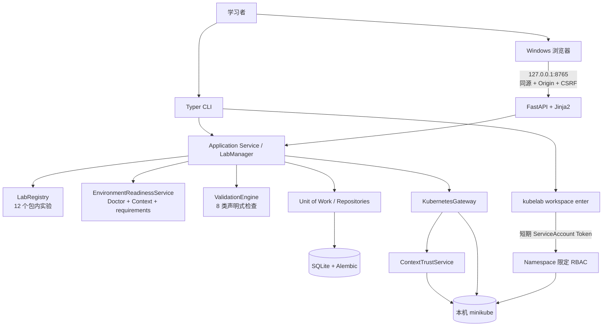
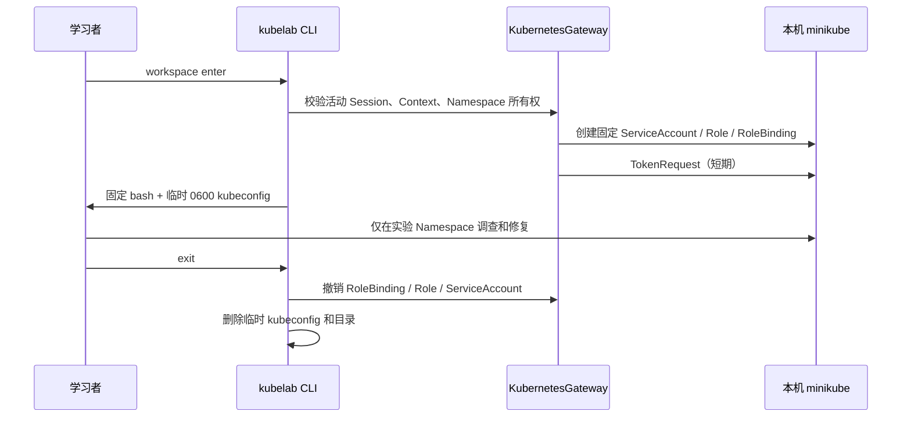

# KubeLab 架构与安全边界

KubeLab 运行在 WSL2 Ubuntu 内，Windows 只负责编辑和访问 loopback Web。CLI 与 Web 是两个入口，但共享唯一业务层；Web 不启动 CLI 子进程，也不直接访问 ORM Session 或 Kubernetes Client。

## 调用边界

- `ApplicationRuntime` 是生产组合根，负责数据库生命周期和共享服务组装。
- CLI 将参数转换为 Application Service 调用，并输出稳定 DTO 与退出码。
- FastAPI lifespan 持有运行时；API 与页面只依赖 `WebApplicationService` 协议。
- `LabRegistry` 在访问集群前完成 Schema、路径与 Manifest 安全扫描。
- `ValidationEngine` 只接收结构化检查，不执行实验提供的任意命令或 URL。
- `KubernetesGateway` 在所有写操作前重新确认 Context、Session、Namespace 和管理标签。

## 受限 workspace

Role 不授权 Secret、RBAC 对象、Namespace 或其他集群级资源。临时 kubeconfig 不复制管理员用户、客户端私钥或证书；退出和异常路径都执行撤销与清理。

## 数据与输出

SQLite只保存Session、状态事件、脱敏验证结果、提示进度、复盘、白名单化readiness缓存和脱敏evidence。`0002_guided_learning`迁移保留v0.1.0数据；已有Session数据库回填为非首次用户，新数据库保持未完成引导。

活动Session恢复与集群协调明确分离：`GET /api/v1/sessions/active`只读SQLite并返回`cluster_state=not_checked`；`POST /api/v1/sessions/active/reconcile`才访问集群。学习阶段从`SessionStatus`派生，时间线合并事件、提示、验证与evidence，不持久化第二套状态。快照采集失败只记录`unavailable`，不改变start/reset/verify/cleanup结果。

公共CLI/API/Web不返回Secret值、验证expected/actual、完整Manifest、凭证或异常堆栈。Web资源DTO只允许资源类型、名称、状态和Pod汇总；日志有行数和字节上限，错误使用稳定的`code/message/context/retryable`结构。
