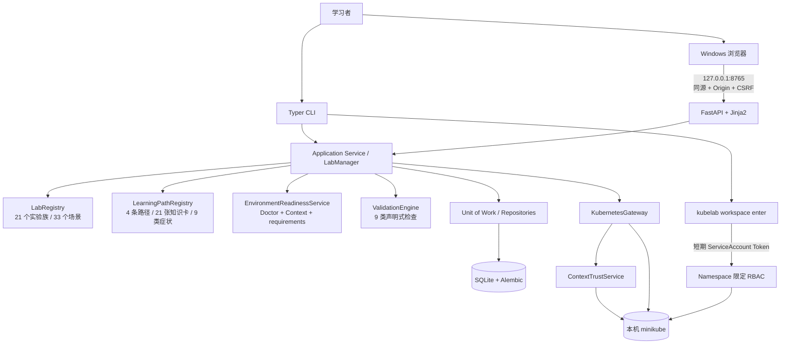
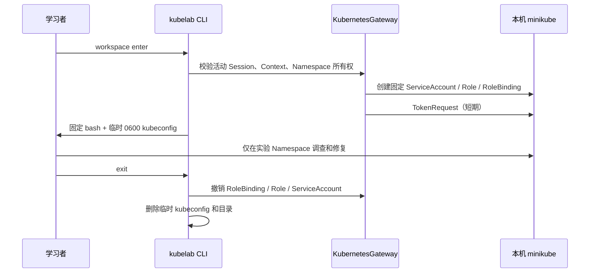

# KubeLab 架构与安全边界

KubeLab 运行在 WSL2 Ubuntu 内，Windows 只负责编辑和访问 loopback Web。CLI 与 Web 是两个入口，但共享唯一业务层；Web 不启动 CLI 子进程，也不直接访问 ORM Session 或 Kubernetes Client。

## 调用边界

- `ApplicationRuntime` 是生产组合根，负责数据库生命周期和共享服务组装。
- CLI 将参数转换为 Application Service 调用，并输出稳定 DTO 与退出码。
- FastAPI lifespan 持有运行时；API 与页面只依赖 `WebApplicationService` 协议。
- `LabRegistry` 在访问集群前完成 Schema、路径与 Manifest 安全扫描。
- `LabRegistry`将父实验与固定变体解析为统一的有效实验对象；Session只持久化已选变体，reset、恢复和reconcile不会重新选择。
- `LearningPathRegistry`只读取包内声明式路径内容，并校验实验引用、节点引用、依赖环和公开内容安全；它不访问数据库或集群。
- `LabManager`把路径定义与既有Session、事件、提示和验证记录组合为节点状态、解锁原因、推荐和专题成果，不持久化路径进度。
- `ValidationEngine` 只接收结构化检查，不执行实验提供的任意命令或 URL。
- `KubernetesGateway` 在所有写操作前重新确认 Context、Session、Namespace 和管理标签。

## 受限 workspace

Role 不授权 Secret、RBAC 对象、Namespace 或其他集群级资源。临时 kubeconfig 不复制管理员用户、客户端私钥或证书；退出和异常路径都执行撤销与清理。

## 数据与输出

SQLite只保存Session、状态事件、脱敏验证结果、提示进度、复盘、白名单化readiness缓存和脱敏evidence。`0002_guided_learning`迁移保留v0.1.0数据；`0003_lab_variants`只在Session增加默认值为`baseline`的变体引用与查询索引，不增加第二套进度状态。

M7不增加数据库迁移。`available/active/completed/locked/review_recommended`路径节点状态、综合实验解锁和下一步建议都在读取时从现有学习事实计算；同一实验出现在多条路径时仍只对应原有Session记录。

活动Session恢复与集群协调明确分离：`GET /api/v1/sessions/active`只读SQLite并返回`cluster_state=not_checked`；`POST /api/v1/sessions/active/reconcile`才访问集群。学习阶段从`SessionStatus`派生，时间线合并事件、提示、验证与evidence，不持久化第二套状态。快照采集失败只记录`unavailable`，不改变start/reset/verify/cleanup结果。

公共CLI/API/Web不返回Secret值、验证expected/actual、完整Manifest、凭证或异常堆栈。Web资源DTO只允许资源类型、名称、状态和Pod汇总；日志有行数和字节上限，错误使用稳定的`code/message/context/retryable`结构。

## M6场景选择与揭示

首次练习固定选择基线。基线成功后，Application Service依次选择尚未完成的`variant-b`、`variant-c`；最近非基线Session未通过时继续该变体，两者都完成后选择最久未练的一个。客户端不能提交`variant_id`。

变体在通过前以`blind_repeat`呈现，只公开现象、成功目标、Namespace、Workspace和逐层提示；通过`success_contract_passed`后立即公开场景名称、关键证据、根因、修复与预防措施。故障地图和复盘都从Session与事件派生，未完成变体只显示匿名占位。盲练是教学呈现边界，不是对本地源码读取者的保密机制。

`dns_resolution`验证器只接受Service名和可选Pod名，由服务端构造同Namespace的固定FQDN，使用固定BusyBox镜像和参数运行短时探针。它不接受任意hostname、Shell或网络目标，原始DNS输出和解析地址不会进入持久化或公共DTO。

## M7专题学习层

四条路径通过包内`content/learning-paths.yaml`声明节点顺序和前置事实。Schema由Pydantic生成并提交为`schemas/learning-path-v1alpha1.schema.json`。Registry发现未知实验、未知节点、依赖环、凭证模式、Secret Manifest或堆栈内容时使整个路径目录失败关闭，但不影响既有实验CLI操作。

路径页面和API均为只读。Dashboard推荐按固定优先级选择：活动Session、未完成基线、需要解锁的固定变体、已解锁综合实验、确定性复习建议。客户端不能提交节点完成状态、路径进度或`variant_id`，实验启动仍调用原有`LabManager.start()`。

实验前知识卡只包含“是什么、为什么、成功目标、关注对象、证据清单”；实验后知识卡只有对应节点完成后才进入公共DTO。症状索引是静态学习导航，不检查真实集群，也不自动诊断或输出修复命令。专题Markdown导出继续执行脱敏、HTML中和和总长度限制。
